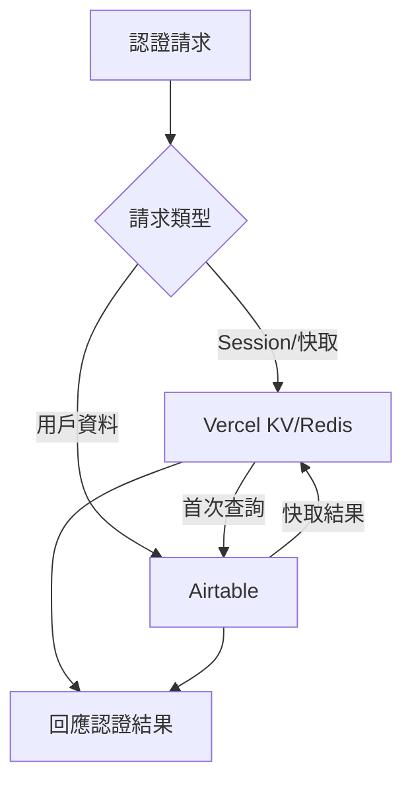

#優化版註冊與 OAuth 登入系統實作計劃

## 架構決策

### 核心技術選型

- **NextAuth.js**: v4.24.5（穩定版，避免 beta 風險）
- **儲存策略**: 混合架構（Vercel KV/Redis 用於 Session 和快取，Airtable 用於持久化用戶資料）
- **密碼加密**: bcryptjs（cost factor: 12）
- **Session**: JWT 策略，30 天過期，24 小時更新頻率

### 混合儲存架構



**好處：**

- 減少 Airtable API 呼叫次數（降低 Rate Limit 風險）
- 提升認證速度（Session 查詢 < 10ms vs Airtable < 200ms）
- 更好的併發處理能力

## 資料庫擴充

### Airtable Customers 表新增欄位

| 欄位名稱 | 類型 | 說明 | 備註 ||---------|------|------|------|| `password_hash` | Single line text | bcrypt 雜湊值 | 僅 Email/Password 註冊使用 || `auth_provider` | Single select | 認證提供者 | 選項：`email`, `google`, `facebook`, `line` || `oauth_id` | Single line text | OAuth 提供者用戶 ID | 唯一索引（在應用層實現） || `email_verified` | Checkbox | Email 驗證狀態 | 預設 false || `last_login_at` | Date | 最後登入時間 | 自動更新 || `oauth_providers` | Long text | 已綁定的 OAuth 提供者（JSON） | 格式：`["google", "facebook"]` |**查詢優化策略：**

- 在應用層維護 email 和 oauth_id 的唯一性索引（使用 Map/Set 快取）
- 使用 Vercel KV 快取熱門查詢結果（TTL: 5 分鐘）

## 實作步驟與優先順序

### P0 高優先級（核心基礎）

#### 1. 定義驗證 Schema

**檔案**: `lib/validation/schemas.ts`

```typescript
import { z } from 'zod';

// 密碼政策：最小 8 字元，至少包含數字和字母
const passwordRegex = /^(?=.*[A-Za-z])(?=.*\d)[A-Za-z\d@$!%*#?&]{8,}$/;

export const registerSchema = z.object({
  name: z.string().min(2, '姓名至少需要 2 個字元'),
  email: z.string().email('請輸入有效的 Email'),
  phone: z.string().regex(/^09\d{8}$/, '請輸入有效的台灣手機號碼'),
  password: z.string()
    .min(8, '密碼至少需要 8 個字元')
    .regex(passwordRegex, '密碼必須包含至少一個字母和一個數字'),
  confirmPassword: z.string(),
}).refine((data) => data.password === data.confirmPassword, {
  message: '密碼與確認密碼不一致',
  path: ['confirmPassword'],
});

export const loginSchema = z.object({
  email: z.string().email('請輸入有效的 Email'),
  password: z.string().min(1, '請輸入密碼'),
});

export const passwordStrengthSchema = z.object({
  password: z.string(),
}).transform((data) => {
  // 計算密碼強度：weak, medium, strong
  const hasLength = data.password.length >= 8;
  const hasLetter = /[A-Za-z]/.test(data.password);
  const hasNumber = /\d/.test(data.password);
  const hasSpecial = /[@$!%*#?&]/.test(data.password);
  
  const score = [hasLength, hasLetter, hasNumber, hasSpecial].filter(Boolean).length;
  return {
    password: data.password,
    strength: score <= 2 ? 'weak' : score === 3 ? 'medium' : 'strong',
  };
});
```


#### 2. 擴充 Customer 類型定義

**檔案**: `types/customer.ts`

```typescript
export type AuthProvider = 'email' | 'google' | 'facebook' | 'line';

export interface Customer {
  id: string;
  name: string;
  phone: string;
  email: string;
  // 認證相關欄位
  password_hash?: string;
  auth_provider: AuthProvider;
  oauth_id?: string;
  email_verified: boolean;
  last_login_at?: string;
  oauth_providers?: string[]; // 已綁定的 OAuth 提供者列表
  // 現有欄位
  total_orders?: number;
  total_spent?: number;
  last_order_date?: string;
  created_at?: string;
}
```


#### 3. 安裝依賴套件

**檔案**: `package.json`

```json
{
  "dependencies": {
    "next-auth": "^4.24.5",
    "bcryptjs": "^2.4.3",
    "@types/bcryptjs": "^2.4.3",
    "@vercel/kv": "^0.2.1" // 用於混合儲存策略
  }
}
```


### P1 中優先級（認證核心）

#### 4. 擴充 Airtable 客戶查詢函數

**檔案**: `lib/airtable/customers.ts`新增函數：

- `getCustomerByEmail(email: string)`: 依 email 查詢
- `getCustomerByOAuthId(oauthId: string, provider: AuthProvider)`: 依 OAuth ID 查詢
- `createCustomerWithAuth(data: CreateCustomerWithAuthRequest)`: 建立帶認證資訊的客戶
- `updateLastLogin(customerId: string)`: 更新最後登入時間
- `checkEmailExists(email: string)`: 檢查 email 是否已存在（註冊前驗證）

**查詢優化：**

- 實作簡單的記憶體內快取（LRU Cache，最多 100 筆，TTL: 5 分鐘）
- 整合 Vercel KV 作為分散式快取（生產環境）

#### 5. 建立 NextAuth 配置

**檔案**: `lib/auth/config.ts`

```typescript
import { NextAuthOptions } from 'next-auth';
import GoogleProvider from 'next-auth/providers/google';
import FacebookProvider from 'next-auth/providers/facebook';
import CredentialsProvider from 'next-auth/providers/credentials';
import { getCustomerByEmail, getCustomerByOAuthId, createCustomerWithAuth } from '@/lib/airtable/customers';
import { verifyPassword } from '@/lib/auth/utils';

export const authOptions: NextAuthOptions = {
  providers: [
    GoogleProvider({
      clientId: process.env.GOOGLE_CLIENT_ID!,
      clientSecret: process.env.GOOGLE_CLIENT_SECRET!,
      authorization: {
        params: {
          scope: 'openid email profile',
        },
      },
    }),
    FacebookProvider({
      clientId: process.env.FACEBOOK_CLIENT_ID!,
      clientSecret: process.env.FACEBOOK_CLIENT_SECRET!,
    }),
    // LINE Provider（需要自訂實作，見下方）
    CredentialsProvider({
      name: 'Email',
      credentials: {
        email: { label: 'Email', type: 'email' },
        password: { label: 'Password', type: 'password' },
      },
      async authorize(credentials) {
        if (!credentials?.email || !credentials?.password) {
          throw new Error('請輸入 Email 和密碼');
        }
        
        const customer = await getCustomerByEmail(credentials.email);
        if (!customer || !customer.password_hash) {
          throw new Error('帳號或密碼錯誤');
        }
        
        const isValid = await verifyPassword(credentials.password, customer.password_hash);
        if (!isValid) {
          throw new Error('帳號或密碼錯誤');
        }
        
        return {
          id: customer.id,
          email: customer.email,
          name: customer.name,
        };
      },
    }),
  ],
  session: {
    strategy: 'jwt',
    maxAge: 30 * 24 * 60 * 60, // 30 天
    updateAge: 24 * 60 * 60,   // 24 小時更新一次
  },
  callbacks: {
    async signIn({ user, account, profile }) {
      // OAuth 登入處理
      if (account?.provider !== 'credentials') {
        const provider = account?.provider as AuthProvider;
        const oauthId = account?.providerAccountId;
        
        // 檢查是否已存在 OAuth 綁定
        let customer = await getCustomerByOAuthId(oauthId, provider);
        
        if (!customer) {
          // 檢查 email 是否已存在（帳號綁定邏輯）
          if (user.email) {
            const existingCustomer = await getCustomerByEmail(user.email);
            if (existingCustomer) {
              // 綁定現有帳號：更新 oauth_id 和 auth_provider
              customer = await bindOAuthProvider(existingCustomer.id, provider, oauthId);
            } else {
              // 建立新用戶
              customer = await createCustomerWithAuth({
                name: user.name || user.email!,
                email: user.email!,
                phone: '', // OAuth 註冊時電話為選填
                auth_provider: provider,
                oauth_id: oauthId,
                email_verified: provider === 'google', // Google 預設驗證
              });
            }
          }
        }
        
        // 更新最後登入時間
        if (customer) {
          await updateLastLogin(customer.id);
          user.id = customer.id;
        }
      }
      
      return true;
    },
    async jwt({ token, user, account }) {
      if (user) {
        token.id = user.id;
        token.email = user.email;
        token.name = user.name;
      }
      return token;
    },
    async session({ session, token }) {
      if (session.user) {
        session.user.id = token.id as string;
        session.user.name = token.name as string;
        session.user.email = token.email as string;
      }
      return session;
    },
  },
  pages: {
    signIn: '/login',
    error: '/login', // 錯誤時導向登入頁
  },
  events: {
    async signIn({ user, account, isNewUser }) {
      // 記錄登入事件（未來可用於審計）
      console.log(`User ${user.email} signed in via ${account?.provider}`);
    },
  },
};
```

**LINE Provider 自訂實作：**LINE Login 需要額外設定，因為 NextAuth.js 不內建支援。需要：

1. 建立自訂 Provider 類別
2. 設定 LINE Login Channel Type（Web App）
3. 處理 LINE 的特殊回調格式
4. 設定 Callback URL 白名單

**檔案**: `lib/auth/providers/line.ts`（新建）

#### 6. 建立認證工具函數

**檔案**: `lib/auth/utils.ts`

```typescript
import bcrypt from 'bcryptjs';
import { getServerSession } from 'next-auth/next';
import { authOptions } from './config';

export async function hashPassword(password: string): Promise<string> {
  return bcrypt.hash(password, 12);
}

export async function verifyPassword(password: string, hash: string): Promise<boolean> {
  return bcrypt.compare(password, hash);
}

export async function getServerSessionWrapper() {
  return getServerSession(authOptions);
}

export async function requireAuth() {
  const session = await getServerSessionWrapper();
  if (!session?.user) {
    throw new Error('Unauthorized');
  }
  return session;
}

export function getPasswordStrength(password: string): 'weak' | 'medium' | 'strong' {
  // 實作密碼強度計算
}
```


#### 7. 建立註冊 API

**檔案**: `app/api/auth/register/route.ts`**錯誤處理策略：**

- Email 已存在：回傳明確錯誤訊息「此 Email 已被註冊，請使用登入或使用其他 Email」
- 電話已存在：回傳「此電話已被使用」
- 網路錯誤：回傳「註冊失敗，請稍後再試」
- Airtable API 限制：實作重試機制（最多 3 次，指數退避）

**回應格式：**

```typescript
// 成功
{ success: true, customerId: string }

// 失敗
{ success: false, error: string, field?: string }
```


### P2 低優先級（UI 與整合）

#### 8-12. UI 實作與整合

- 註冊頁面：表單驗證、密碼強度指示器、OAuth 按鈕、Loading 狀態
- 登入頁面：錯誤訊息顯示、OAuth 按鈕、Loading 狀態
- Header 更新：顯示登入狀態、登出功能
- CheckoutForm 整合：自動填入已登入用戶資訊

## 錯誤處理與 UX 設計

### 錯誤情境處理

| 情境 | 處理方式 | UI 反饋 ||------|---------|---------|| Email 已被註冊 | 檢查 email 唯一性，回傳明確錯誤 | 紅色錯誤訊息 + 建議「前往登入」連結 || OAuth 綁定現有帳號 | 依 email 匹配，自動綁定 | 顯示「已連結您的帳號」訊息 || 網路錯誤 | 重試機制（最多 3 次） | Loading 狀態 + 錯誤提示 || OAuth 授權失敗 | 記錄錯誤日誌 | 友善錯誤頁面 + 重試按鈕 || 密碼強度不足 | Zod 驗證攔截 | 即時顯示密碼強度指示器 || Airtable API 限制 | 實作重試 + 快取 | 降級處理（顯示「服務忙碌」） |

### Loading 狀態設計

- 註冊/登入按鈕：點擊後顯示 Spinner 並禁用
- OAuth 按鈕：點擊後顯示「正在導向...」
- 表單提交期間：禁用所有輸入欄位

## 測試策略

### 單元測試

**檔案**: `__tests__/auth/utils.test.ts`

```typescript
describe('Password Hashing', () => {
  it('should hash password correctly', async () => {
    const hash = await hashPassword('Test1234');
    expect(hash).toBeDefined();
    expect(hash).not.toBe('Test1234');
  });
  
  it('should verify password correctly', async () => {
    const hash = await hashPassword('Test1234');
    const isValid = await verifyPassword('Test1234', hash);
    expect(isValid).toBe(true);
  });
});
```


### 整合測試

**檔案**: `__tests__/auth/register-flow.test.ts`

- 測試註冊 → 登入完整流程
- 測試 Email 重複檢查
- 測試 OAuth 綁定邏輯

### E2E 測試

使用 Playwright 測試：

- 註冊流程
- 登入流程
- OAuth 流程（使用 Mock Provider）

### 安全測試

- SQL Injection 防護（驗證輸入清理）
- XSS 防護（驗證輸出編碼）
- CSRF 保護（NextAuth.js 內建）

## 效能監控指標

### 目標指標

- **註冊 API 回應時間**: < 2 秒（P95）
- **登入 API 回應時間**: < 1 秒（P95）
- **Airtable API 呼叫次數**: < 100 次/分鐘（單一客戶）
- **失敗率警報閾值**: > 5%（每 5 分鐘）

### 監控實作

**檔案**: `lib/monitoring/auth-metrics.ts`（新建）

```typescript
// 記錄認證相關指標
export function trackAuthMetric(event: string, duration: number, success: boolean) {
  // 發送到監控服務（如 Vercel Analytics、Sentry）
}
```


## 資料遷移策略

### 處理現有客戶資料

**檔案**: `scripts/migrate-existing-customers.ts`（新建）

```typescript
// 腳本功能：
// 1. 掃描所有現有 Customers 記錄
// 2. 為未認證客戶設定預設值（auth_provider: 'email', email_verified: false）
// 3. 檢查並標記重複 email（需要人工處理）
// 4. 生成遷移報告
```


### Rollback 計畫

- 保留舊版 API Route（版本化路由：`/api/v1/auth/...`）
- 資料庫欄位設為可選（向後相容）
- 部署前在 Staging 環境完整測試

## 環境變數設定

**檔案**: `.env.local`（新增）

```env
# NextAuth
NEXTAUTH_URL=http://localhost:3000
NEXTAUTH_SECRET=your-secret-key # 使用 openssl rand -base64 32 產生

# OAuth - Google
GOOGLE_CLIENT_ID=your-google-client-id
GOOGLE_CLIENT_SECRET=your-google-client-secret

# OAuth - Facebook
FACEBOOK_CLIENT_ID=your-facebook-app-id
FACEBOOK_CLIENT_SECRET=your-facebook-app-secret

# OAuth - LINE
LINE_CLIENT_ID=your-line-channel-id
LINE_CLIENT_SECRET=your-line-channel-secret

# Vercel KV (生產環境)
KV_URL=your-kv-url
KV_REST_API_URL=your-kv-rest-api-url
KV_REST_API_TOKEN=your-kv-rest-api-token
```


## 未來擴充功能

### Phase 2 功能（預留擴充空間）

1. **Email 驗證**

- 註冊後發送驗證信
- 驗證連結有效期 24 小時
- 未驗證帳號限制功能

2. **Remember Me**

- 勾選後延長 Session 至 90 天

3. **帳號綁定管理**

- 用戶設定頁面
- 可連結/解除連結多個 OAuth 提供者

4. **登入歷史記錄**

- 記錄登入 IP、時間、裝置
- 用於安全審計

## 檔案結構

```javascript
app/
├── (customer)/
│   ├── register/
│   │   └── page.tsx          # 註冊頁面
│   ├── login/
│   │   └── page.tsx           # 登入頁面
│   └── ...
├── api/
│   └── auth/
│       ├── [...nextauth]/
│       │   └── route.ts       # NextAuth 處理器
│       └── register/
│           └── route.ts       # 註冊 API

lib/
├── auth/
│   ├── config.ts              # NextAuth 配置
│   ├── utils.ts               # 認證工具函數
│   ├── providers/
│   │   └── line.ts            # LINE Provider 自訂實作
│   └── cache.ts               # 快取層（Vercel KV 包裝）
└── airtable/
    └── customers.ts           # 擴充客戶查詢函數

types/
└── customer.ts                # 擴充：認證相關欄位

__tests__/
└── auth/                      # 認證相關測試
    ├── utils.test.ts
    ├── register-flow.test.ts
    └── oauth-flow.test.ts
```


## 安全考量（更新）

1. **密碼加密**: bcrypt（cost factor: 12）
2. **Session 管理**: JWT，30 天過期，24 小時更新
3. **CSRF 保護**: NextAuth.js 內建
4. **輸入驗證**: Zod Schema 嚴格驗證
5. **OAuth 回調驗證**: NextAuth.js 自動處理
6. **密碼政策**: 最小 8 字元，包含字母和數字
7. **Rate Limiting**: 實作註冊/登入頻率限制（防止暴力破解）
8. **密碼雜湊安全性**: 使用 Airtable 欄位加密或考慮環境變數加密層

## 實施時間估算

- **P0 階段**（核心基礎）: 4-6 小時
- **P1 階段**（認證核心）: 8-12 小時
- **P2 階段**（UI 與整合）: 6-8 小時