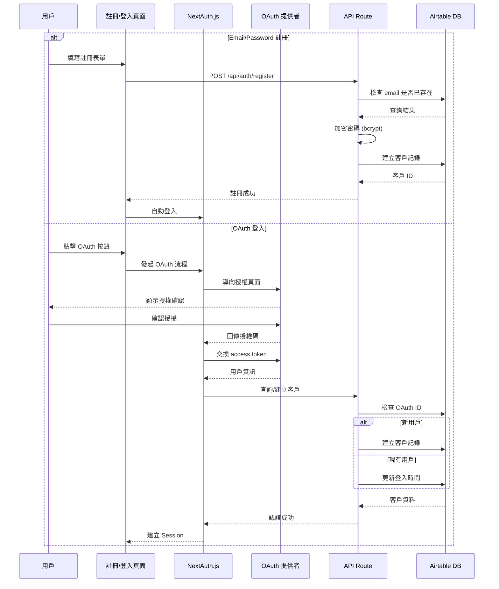

# 註冊與

OAuth 登入系統實作計劃

## 架構概覽

系統將使用 **NextAuth.js v5 (Auth.js)** 作為認證核心，整合多種 OAuth 提供者，並將用戶資料儲存在 Airtable Customers 表中。

### 認證流程圖




## 實作步驟

### 1. 安裝依賴套件

安裝以下套件：

- `next-auth@beta` (NextAuth.js v5)
- `bcryptjs` 和 `@types/bcryptjs` (密碼加密)
- `@auth/airtable-adapter` (可選，或自訂 adapter)

### 2. 擴充 Airtable Customers 表

在 Airtable Customers 表中新增以下欄位：| 欄位名稱 | 欄位類型 | 說明 ||---------|---------|------|| `password_hash` | Single line text | 密碼雜湊值（Email/Password 註冊用） || `auth_provider` | Single select | 認證提供者：email, google, facebook, line || `oauth_id` | Single line text | OAuth 提供者的用戶 ID || `email_verified` | Checkbox | Email 是否已驗證 || `last_login_at` | Date | 最後登入時間 |更新相關檔案：

- `types/customer.ts` - 新增認證相關欄位
- `lib/airtable/customers.ts` - 新增查詢函數（依 email、oauth_id 查詢）

### 3. 設定 NextAuth.js

建立 `app/api/auth/[...nextauth]/route.ts`：

- 設定 OAuth 提供者（Google、Facebook、LINE）
- 實作 Credentials Provider（Email/Password）
- 設定自訂 Airtable Adapter
- 配置 Session 策略和 JWT

建立 `lib/auth/config.ts`：

- 集中管理 NextAuth 配置
- 定義 OAuth 提供者設定

### 4. 建立註冊頁面

建立 `app/(customer)/register/page.tsx`：

- 使用 React Hook Form + Zod 驗證
- 表單欄位：姓名、Email、電話、密碼、確認密碼
- OAuth 登入按鈕（Gmail、Facebook、LINE）
- 註冊成功後自動登入並導向首頁

建立 `app/api/auth/register/route.ts`：

- 驗證表單資料
- 檢查 Email 和電話是否已存在
- 使用 bcrypt 加密密碼
- 在 Airtable 建立客戶記錄
- 回傳成功/錯誤訊息

### 5. 建立登入頁面

建立 `app/(customer)/login/page.tsx`：

- Email/Password 登入表單
- OAuth 登入按鈕
- 「忘記密碼」連結（未來擴充）
- 「前往註冊」連結

### 6. 更新驗證 Schema

在 `lib/validation/schemas.ts` 新增：

- `registerSchema` - 註冊表單驗證
- `loginSchema` - 登入表單驗證

### 7. 更新 Header 元件

更新 `components/shared/Header.tsx`：

- 顯示登入狀態（已登入/未登入）
- 顯示用戶名稱
- 登出按鈕
- 登入/註冊連結（未登入時）

### 8. 建立認證工具函數

建立 `lib/auth/utils.ts`：

- `getServerSession()` - 取得伺服器端 Session
- `requireAuth()` - 保護 API Route（需要登入）
- 密碼加密/驗證函數

### 9. 環境變數設定

在 `.env.local` 新增：

```env
# NextAuth
NEXTAUTH_URL=http://localhost:3000
NEXTAUTH_SECRET=your-secret-key

# OAuth - Google
GOOGLE_CLIENT_ID=your-google-client-id
GOOGLE_CLIENT_SECRET=your-google-client-secret

# OAuth - Facebook
FACEBOOK_CLIENT_ID=your-facebook-app-id
FACEBOOK_CLIENT_SECRET=your-facebook-app-secret

# OAuth - LINE
LINE_CLIENT_ID=your-line-channel-id
LINE_CLIENT_SECRET=your-line-channel-secret
```


### 10. 更新訂單流程

更新 `components/customer/CheckoutForm.tsx`：

- 如果用戶已登入，自動填入客戶資訊
- 未登入用戶仍可下單（保持現有流程）

## 檔案結構

```javascript
app/
├── (customer)/
│   ├── register/
│   │   └── page.tsx          # 註冊頁面
│   ├── login/
│   │   └── page.tsx           # 登入頁面
│   └── ...
├── api/
│   └── auth/
│       ├── [...nextauth]/
│       │   └── route.ts       # NextAuth 處理器
│       └── register/
│           └── route.ts       # 註冊 API

lib/
├── auth/
│   ├── config.ts              # NextAuth 配置
│   └── utils.ts               # 認證工具函數
└── airtable/
    └── customers.ts           # 擴充客戶查詢函數

components/
└── shared/
    ├── Header.tsx             # 更新：顯示登入狀態
    └── OAuthButton.tsx        # OAuth 登入按鈕元件（可選）

types/
└── customer.ts                # 擴充：認證相關欄位
```


## 安全考量

1. **密碼加密**：使用 bcrypt（cost factor: 12）
2. **Session 管理**：使用 JWT，設定合理的過期時間
3. **CSRF 保護**：NextAuth.js 內建保護
4. **輸入驗證**：所有輸入都經過 Zod Schema 驗證
5. **OAuth 回調驗證**：NextAuth.js 自動處理

## 資料庫變更