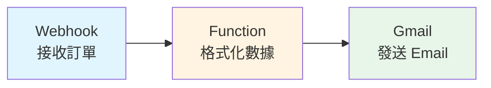

# 系統設定指南

本文件說明如何設定咖啡豆訂單系統的完整環境。

> **相關文件：**
> - [README.md](README.md) - 專案說明和快速開始
> - [DATABASE.md](DATABASE.md) - 詳細的資料庫結構說明

## 一、Airtable 設定

### 1. 建立 Base

1. 登入 [Airtable](https://airtable.com)
2. 建立新的 Base，命名為「咖啡豆訂單系統」

### 2. 建立 Tables 與欄位

#### **Products Table（商品表）**

| 欄位名稱 | 欄位類型 | 選項/說明 |
|---------|---------|----------|
| `name` | Single line text | 商品名稱 |
| `description` | Long text | 商品描述 |
| `price` | Number | 格式：Decimal (0.00) |
| `image_url` | URL | 商品圖片網址 |
| `stock` | Number | 格式：Integer |
| `grind_option` | Single select | 選項：不磨、磨手沖、磨義式 |
| `is_active` | Checkbox | 是否上架 |
| `created_at` | Created time | 自動建立 |
| `updated_at` | Last modified time | 自動更新 |

#### **Orders Table（訂單主檔）**

| 欄位名稱 | 欄位類型 | 選項/說明 |
|---------|---------|----------|
| `order_id` | Single line text | 訂單編號（唯一） |
| `customer_name` | Single line text | 顧客姓名 |
| `customer_phone` | Phone number | 顧客電話 |
| `customer_email` | Email | 顧客 Email |
| `pickup_method` | Single select | 選項：自取、外送 |
| `payment_method` | Single select | 選項：現金、轉帳、信用卡 |
| `total_amount` | Number | 總金額 |
| `discount_amount` | Number | 折扣金額 |
| `final_amount` | Number | 實付金額 |
| `status` | Single select | 選項：pending、processing、completed、picked_up、cancelled |
| `order_items` | Linked record | 連結到 Order Items |
| `customer` | Linked record | 連結到 Customers |
| `notes` | Long text | 備註 |
| `created_at` | Created time | 自動建立 |
| `updated_at` | Last modified time | 自動更新 |

#### **Order Items Table（訂單明細）**

| 欄位名稱 | 欄位類型 | 選項/說明 |
|---------|---------|----------|
| `order` | Linked record | 連結到 Orders（**單一連結**：只能連結一個 Orders 記錄） |
| `product` | Linked record | 連結到 Products |
| `product_name` | Single line text | 商品名稱（快照） |
| `quantity` | Number | 數量 |
| `unit_price` | Number | 單價 |
| `grind_option` | Single select | 選項：不磨、磨手沖、磨義式 |
| `subtotal` | Formula | 公式：`{quantity} * {unit_price}` |

#### **Customers Table（客戶表）**

| 欄位名稱 | 欄位類型 | 選項/說明 |
|---------|---------|----------|
| `name` | Single line text | 姓名 |
| `phone` | Phone number | 電話（唯一） |
| `email` | Email | Email |
| `total_orders` | Number | 總訂單數（格式：Integer，系統自動更新） |
| `total_spent` | Currency | 總消費金額（系統自動更新） |
| `last_order_date` | Date | 最後訂購日期（系統自動更新） |
| `created_at` | Created time | 自動建立 |

#### **Order Status Log Table（訂單狀態歷程）**

| 欄位名稱 | 欄位類型 | 選項/說明 |
|---------|---------|----------|
| `order` | Linked record | 連結到 Orders（**必須正確連結到 Orders 表**） |
| `status` | Single select | 狀態（選項：pending、processing、completed、picked_up、cancelled） |
| `changed_by` | Single line text | 變更者 |
| `notes` | Long text | 備註 |
| `changed_at` | Created time | 自動建立 |

**重要設定：**
- `order` 欄位必須連結到 `Orders` 表（不是其他表）
- 如果 `order` 欄位連結到錯誤的表，會導致訂單狀態歷程記錄創建失敗
- 即使狀態歷程記錄創建失敗，訂單創建流程仍會繼續（系統已處理此情況）

### 3. 欄位對應關係（程式碼 ↔ Airtable）

以下表格說明程式碼中使用的欄位名稱與 Airtable 表中的欄位名稱對應關係，以及選項值的轉換規則。

#### **Products Table（商品表）**

| Airtable 欄位名稱 | 程式碼欄位名稱 | 資料類型 | 說明 |
|-----------------|--------------|---------|------|
| `name` | `name` | Single line text | 商品名稱 |
| `description` | `description` | Long text | 商品描述 |
| `price` | `price` | Number | 價格（Decimal 0.00） |
| `image_url` | `image_url` | URL | 商品圖片網址 |
| `stock` | `stock` | Number | 庫存（Integer） |
| `grind_option` | `grind_option` | Single select | 研磨選項（見下方選項值對應） |
| `is_active` | `is_active` | Checkbox | 是否上架 |
| `created_at` | `created_at` | Created time | 自動建立（只讀） |
| `updated_at` | `updated_at` | Last modified time | 自動更新（只讀） |

**選項值對應（grind_option）：**
- 程式碼 enum 值 → Airtable 選項值
- `none` → `不磨`
- `hand_drip` → `磨手沖`
- `espresso` → `磨義式`

#### **Orders Table（訂單主檔）**

| Airtable 欄位名稱 | 程式碼欄位名稱 | 資料類型 | 說明 |
|-----------------|--------------|---------|------|
| `order_id` | `order_id` | Single line text | 訂單編號（唯一，格式：ORD-YYYYMMDD-XXXX） |
| `customer_name` | `customer_name` | Single line text | 顧客姓名 |
| `customer_phone` | `customer_phone` | Phone number | 顧客電話 |
| `customer_email` | `customer_email` | Email | 顧客 Email |
| `pickup_method` | `pickup_method` | Single select | 取件方式（見下方選項值對應） |
| `payment_method` | `payment_method` | Single select | 付款方式（見下方選項值對應） |
| `total_amount` | `total_amount` | Number | 總金額 |
| `discount_amount` | `discount_amount` | Number | 折扣金額 |
| `final_amount` | `final_amount` | Number | 實付金額 |
| `status` | `status` | Single select | 訂單狀態（見下方選項值對應） |
| `order_items` | `order_items` | Linked record | 連結到 Order Items（建立訂單後更新） |
| `customer` | `customer` | Linked record | 連結到 Customers（建立訂單時提供） |
| `notes` | `notes` | Long text | 備註 |
| `created_at` | `created_at` | Created time | 自動建立（只讀） |
| `updated_at` | `updated_at` | Last modified time | 自動更新（只讀） |

**選項值對應（pickup_method）：**
- 程式碼 enum 值 → Airtable 選項值
- `self_pickup` → `自取`
- `delivery` → `外送`

**選項值對應（payment_method）：**
- 程式碼 enum 值 → Airtable 選項值
- `cash` → `現金`
- `transfer` → `轉帳`
- `credit_card` → `信用卡`

**選項值對應（status）：**
- 程式碼 enum 值 → Airtable 選項值（直接使用，無需轉換）
- `pending` → `pending`
- `processing` → `processing`
- `completed` → `completed`
- `picked_up` → `picked_up`
- `cancelled` → `cancelled`

#### **Order Items Table（訂單明細）**

| Airtable 欄位名稱 | 程式碼欄位名稱 | 資料類型 | 說明 |
|-----------------|--------------|---------|------|
| `order` | `order` | Linked record | 連結到 Orders（陣列格式：`[recordId]`） |
| `product` | `product` | Linked record | 連結到 Products（陣列格式：`[recordId]`） |
| `product_name` | `product_name` | Single line text | 商品名稱（快照） |
| `quantity` | `quantity` | Number | 數量 |
| `unit_price` | `unit_price` | Number | 單價 |
| `grind_option` | `grind_option` | Single select | 研磨選項（見下方選項值對應） |
| `subtotal` | `subtotal` | Formula | 小計（公式：`{quantity} * {unit_price}`，只讀） |

**選項值對應（grind_option）：**
- 程式碼 enum 值 → Airtable 選項值
- `none` → `不磨`
- `hand_drip` → `磨手沖`
- `espresso` → `磨義式`

#### **Customers Table（客戶表）**

| Airtable 欄位名稱 | 程式碼欄位名稱 | 資料類型 | 說明 |
|-----------------|--------------|---------|------|
| `name` | `name` | Single line text | 姓名 |
| `phone` | `phone` | Phone number | 電話（唯一） |
| `email` | `email` | Email | Email |
| `total_orders` | `total_orders` | Number | 總訂單數（系統自動更新） |
| `total_spent` | `total_spent` | Currency | 總消費金額（系統自動更新） |
| `last_order_date` | `last_order_date` | Date | 最後訂購日期（系統自動更新） |
| `created_at` | `created_at` | Created time | 自動建立（只讀） |

#### **Order Status Log Table（訂單狀態歷程）**

| Airtable 欄位名稱 | 程式碼欄位名稱 | 資料類型 | 說明 |
|-----------------|--------------|---------|------|
| `order` | `order` | Linked record | 連結到 Orders（陣列格式：`[recordId]`，**必須連結到 Orders 表**） |
| `status` | `status` | Single select | 狀態（與 Orders.status 相同，見下方選項值） |
| `changed_by` | `changed_by` | Single line text | 變更者 |
| `notes` | `notes` | Long text | 備註 |
| `changed_at` | `changed_at` | Created time | 自動建立（只讀） |

**選項值對應（status）：**
- 程式碼 enum 值 → Airtable 選項值（直接使用，無需轉換）
- `pending` → `pending`
- `processing` → `processing`
- `completed` → `completed`
- `picked_up` → `picked_up`
- `cancelled` → `cancelled`

**重要注意事項：**
- `order` 欄位必須正確連結到 `Orders` 表
- 如果連結到錯誤的表，會導致 `INVALID_VALUE_FOR_COLUMN` 錯誤
- 系統已處理狀態歷程記錄創建失敗的情況，不會影響訂單創建流程

### 4. 重要注意事項

1. **Single Select 欄位選項值必須手動添加：**
   - 由於 Airtable SDK 0.12.2 不支持 `typecast` 選項，所有 Single select 欄位的選項值必須在 Airtable 界面中手動添加
   - 必須添加的選項值：
     - `pickup_method`: `自取`、`外送`
     - `payment_method`: `現金`、`轉帳`、`信用卡`
     - `grind_option`: `不磨`、`磨手沖`、`磨義式`
     - `status`: `pending`、`processing`、`completed`、`picked_up`、`cancelled`

2. **Linked Record 欄位格式：**
   - 在程式碼中，Linked record 欄位必須以陣列格式提供：`[recordId]`
   - 例如：`customer: [customer.id]`、`order: [orderRecord.id]`
   - **重要**：即使欄位設定為「單一連結」（只能連結一個記錄），API 仍需要使用陣列格式：`["recXXX"]`

3. **Linked Record 欄位設定（單一連結 vs 多個連結）：**
   - **Order Items 表的 `order` 欄位**：必須設定為「單一連結」（只能連結一個 Orders 記錄）
     - 在 Airtable 中，點擊 `order` 欄位的設定圖示（齒輪圖示）
     - 找到「Allow linking to multiple records」選項
     - **取消勾選**此選項（設為單一連結）
     - **確認「連結的表」設定為 `Orders` 表**（不是其他表）
     - 儲存設定
   - **Orders 表的 `order_items` 欄位**：可以設定為「多個連結」（可以連結多個 Order Items 記錄）
     - 勾選「Allow linking to multiple records」選項
     - **確認「連結的表」設定為 `Order Items` 表**
   - **Order Status Log 表的 `order` 欄位**：必須正確連結到 `Orders` 表
     - 在 Airtable 中，點擊 `order` 欄位的設定圖示（齒輪圖示）
     - **確認「連結的表」設定為 `Orders` 表**（不是其他表）
     - 如果連結到錯誤的表，會導致狀態歷程記錄創建失敗
     - 儲存設定

4. **欄位名稱必須完全匹配：**
   - Airtable 表中的欄位名稱必須與程式碼中使用的欄位名稱完全一致（包括大小寫和空格）
   - 建議複製貼上，避免手動輸入錯誤

5. **轉換函數位置：**
   - 選項值轉換函數位於 `lib/airtable/orders.ts`：
     - `convertPickupMethodToAirtable()`: 轉換取件方式
     - `convertPaymentMethodToAirtable()`: 轉換付款方式
     - `convertGrindOptionToAirtable()`: 轉換研磨選項

### 5. 取得 API 金鑰與 Base ID

1. 前往 [Airtable Account](https://airtable.com/account)
2. 複製 **Personal access token**（API Key）
3. 前往 Base，點擊右上角「Help」→「API documentation」
4. 複製 **Base ID**

## 二、N8N 設定

### 1. 部署 N8N

#### 選項 A：N8N Cloud（推薦）

1. 前往 [N8N Cloud](https://n8n.io/cloud/)
2. 註冊帳號並建立工作空間
3. 取得 Webhook URL

#### 選項 B：自架 N8N

```bash
# 使用 Docker
docker run -it --rm \
  --name n8n \
  -p 5678:5678 \
  -v ~/.n8n:/home/node/.n8n \
  n8nio/n8n
```

### 2. 建立 Workflow 1：訂單建立流程（Gmail Email 通知）

本 Workflow 會在收到訂單時自動發送格式化的 Email 通知到您的 Gmail 信箱。

#### Workflow 流程圖



#### 步驟 1：建立新 Workflow

1. 在 N8N 中點擊「Add Workflow」
2. 命名為「訂單建立 - Gmail 通知」
3. 點擊「Save」儲存

#### 步驟 2：設定 Webhook 節點

1. **新增 Webhook 節點**
   - 從左側節點列表拖拽「Webhook」節點到畫布
   - 雙擊節點開啟設定

2. **配置 Webhook 設定**
   - **HTTP Method**: 選擇 `POST`
   - **Path**: 輸入 `/order-created`
   - **Response Mode**: 選擇 `Respond When Last Node Finishes`
   - **Authentication**: 選擇 `None`（如果使用 Webhook Secret，選擇 `Header Auth`）

3. **取得 Webhook URL**
   - 點擊「Execute Node」按鈕
   - 複製顯示的 Webhook URL，格式為：
     ```
     https://qwerboy.app.n8n.cloud/webhook/order-created
     ```
   - 將此 URL 設定到系統環境變數 `N8N_WEBHOOK_URL`

4. **Webhook Secret（可選）**
   - 如果系統設定了 `N8N_WEBHOOK_SECRET`，需要在 Webhook 節點中驗證
   - 在「Authentication」中選擇「Header Auth」
   - Header Name: `X-Webhook-Secret`
   - Header Value: 與系統環境變數中的 `N8N_WEBHOOK_SECRET` 相同

#### 步驟 3：設定 Function 節點（數據格式化）

1. **新增 Function 節點**
   - 從左側節點列表拖拽「Code」節點到畫布
   - 將 Webhook 節點的輸出連接到 Function 節點
   - 雙擊節點開啟設定

2. **設定 Code 節點執行模式**

   在 Code 節點的設定中，找到「Mode」選項：
   - 選擇 **「Run Once for All Items」**（為所有項目執行一次）
   - 這會讓 `items` 變數可用

3. **輸入以下 JavaScript 代碼**

```javascript
// 取得訂單數據
// 方法 1：如果使用 "Run Once for All Items" 模式
const order = items[0].json;

// 方法 2：如果使用 "Run Once for Each Item" 模式（備用方案）
// const order = $input.item.json;

// 轉換函數：取件方式
function formatPickupMethod(method) {
  const map = {
    'self_pickup': '自取',
    'delivery': '外送'
  };
  return map[method] || method;
}

// 轉換函數：付款方式
function formatPaymentMethod(method) {
  const map = {
    'cash': '現金',
    'transfer': '轉帳',
    'credit_card': '信用卡'
  };
  return map[method] || method;
}

// 轉換函數：研磨選項
function formatGrindOption(option) {
  const map = {
    'none': '不磨',
    'hand_drip': '磨手沖',
    'espresso': '磨義式'
  };
  return map[option] || option;
}

// 格式化金額
function formatCurrency(amount) {
  return new Intl.NumberFormat('zh-TW', {
    style: 'currency',
    currency: 'TWD',
    minimumFractionDigits: 0
  }).format(amount);
}

// 處理訂單明細
const orderItems = order.order_items.map((item, index) => {
  const subtotal = item.quantity * item.unit_price;
  return {
    index: index + 1,
    product_name: item.product_name,
    quantity: item.quantity,
    unit_price: item.unit_price,
    grind_option: formatGrindOption(item.grind_option),
    subtotal: subtotal,
    subtotal_formatted: formatCurrency(subtotal)
  };
});

// 計算總計
const totalItems = orderItems.reduce((sum, item) => sum + item.subtotal, 0);

// 返回格式化後的數據（N8N 需要返回數組格式）
return [{
  json: {
    // 訂單基本資訊
    order_id: order.order_id,
    customer_name: order.customer_name,
    customer_phone: order.customer_phone,
    customer_email: order.customer_email,
    
    // 訂單詳情
    pickup_method: formatPickupMethod(order.pickup_method),
    payment_method: formatPaymentMethod(order.payment_method),
    total_amount: order.total_amount,
    total_amount_formatted: formatCurrency(order.total_amount),
    final_amount: order.final_amount,
    final_amount_formatted: formatCurrency(order.final_amount),
    
    // 訂單明細
    order_items: orderItems,
    order_items_count: orderItems.length,
    
    // 備註
    notes: order.notes || '無',
    
    // 用於 Email 的格式化字串
    items_text: orderItems.map(item => 
      `${item.index}. ${item.product_name} x${item.quantity} (${item.grind_option}) - ${item.subtotal_formatted}`
    ).join('\n'),
    
    // 用於 HTML Email 的表格行
    items_html: orderItems.map(item => `
      <tr>
        <td style="padding: 8px; border-bottom: 1px solid #ddd;">${item.product_name}</td>
        <td style="padding: 8px; border-bottom: 1px solid #ddd; text-align: center;">${item.quantity}</td>
        <td style="padding: 8px; border-bottom: 1px solid #ddd; text-align: right;">${item.subtotal_formatted}</td>
        <td style="padding: 8px; border-bottom: 1px solid #ddd;">${item.grind_option}</td>
      </tr>
    `).join('')
  }
}];
```

**重要說明：**
- **執行模式設定**：Code 節點有兩種執行模式：
  - **「Run Once for All Items」**（推薦）：使用 `items[0].json` 取得第一個輸入項目
  - **「Run Once for Each Item」**：使用 `$input.item.json` 取得當前項目
- **如果出現「Cannot find name 'items'」錯誤**：
  - 確認 Code 節點的「Mode」設定為「Run Once for All Items」
  - 或者將代碼中的 `items[0].json` 改為 `$input.item.json`（如果使用「Run Once for Each Item」模式）
- **返回格式**：必須返回一個數組，每個元素包含 `json` 屬性
- **除錯**：可以使用 `console.log(order)` 來檢查數據，輸出會顯示在 N8N 的執行日誌中

3. **儲存 Function 節點**
   - 點擊「Save」儲存設定

#### 步驟 4：設定 Gmail 節點

1. **新增 Gmail 節點**
   - 從左側節點列表拖拽「Gmail」節點到畫布
   - 將 Function 節點的輸出連接到 Gmail 節點
   - 雙擊節點開啟設定

2. **Gmail OAuth 認證設定**

   **方法 A：使用 N8N Cloud 內建的 Gmail 認證（推薦）**
   
   - 在 Gmail 節點中，點擊「Credential」旁的「Create New」
   - 選擇「Gmail OAuth2 API」
   - 點擊「Connect my account」
   - 選擇要使用的 Gmail 帳號
   - 授權 N8N 存取您的 Gmail
   - 完成後，認證會自動儲存

   **方法 B：使用自訂 Gmail API 憑證**
   
   如果需要使用自訂的 Gmail API 憑證：
   
   1. 前往 [Google Cloud Console](https://console.cloud.google.com/)
   2. 建立新專案或選擇現有專案
   3. 啟用 Gmail API：
      - 前往「APIs & Services」→「Library」
      - 搜尋「Gmail API」
      - 點擊「Enable」
   4. 建立 OAuth 2.0 憑證：
      - 前往「APIs & Services」→「Credentials」
      - 點擊「Create Credentials」→「OAuth client ID」
      - 應用程式類型選擇「Web application」
      - 授權重新導向 URI：`https://qwerboy.app.n8n.cloud/rest/oauth2-credential/callback`
      - 複製「Client ID」和「Client Secret」
   5. 在 N8N 中設定：
      - 在 Gmail 節點中建立新認證
      - 選擇「Gmail OAuth2 API」
      - 輸入 Client ID 和 Client Secret
      - 完成 OAuth 流程

3. **配置 Email 設定**

   - **Operation**: 選擇 `Send Email`
   - **From Email**: 選擇您的 Gmail 地址（或使用 `{{ $json.customer_email }}` 從訂單數據取得）
   - **To Email**: 輸入您要接收通知的 Gmail 地址（例如：`your-email@gmail.com`）
   - **Subject**: 輸入以下內容：
     ```
     新訂單通知 - {{ $json.order_id }}
     ```
   - **Email Type**: 選擇 `HTML`
   - **Message**: 輸入以下 HTML 內容（見下方 Email 範本）

4. **Email 範本（HTML 格式）**

   在 Gmail 節點的「Message」欄位中貼上以下 HTML：

```html
<!DOCTYPE html>
<html>
<head>
  <meta charset="UTF-8">
  <style>
    body { font-family: Arial, sans-serif; line-height: 1.6; color: #333; }
    .container { max-width: 600px; margin: 0 auto; padding: 20px; }
    .header { background-color: #8B4513; color: white; padding: 20px; text-align: center; border-radius: 5px 5px 0 0; }
    .content { background-color: #f9f9f9; padding: 20px; border: 1px solid #ddd; }
    .section { margin-bottom: 20px; }
    .section-title { font-weight: bold; color: #8B4513; margin-bottom: 10px; font-size: 16px; }
    table { width: 100%; border-collapse: collapse; margin: 10px 0; }
    th { background-color: #8B4513; color: white; padding: 10px; text-align: left; }
    td { padding: 8px; border-bottom: 1px solid #ddd; }
    .total { font-size: 18px; font-weight: bold; color: #8B4513; text-align: right; margin-top: 10px; }
    .footer { text-align: center; color: #666; font-size: 12px; margin-top: 20px; }
  </style>
</head>
<body>
  <div class="container">
    <div class="header">
      <h1>☕ 新訂單通知</h1>
    </div>
    <div class="content">
      <div class="section">
        <div class="section-title">訂單編號</div>
        <div>{{ $json.order_id }}</div>
      </div>
      
      <div class="section">
        <div class="section-title">客戶資訊</div>
        <div><strong>姓名：</strong>{{ $json.customer_name }}</div>
        <div><strong>電話：</strong>{{ $json.customer_phone }}</div>
        <div><strong>Email：</strong>{{ $json.customer_email }}</div>
      </div>
      
      <div class="section">
        <div class="section-title">訂單詳情</div>
        <div><strong>取件方式：</strong>{{ $json.pickup_method }}</div>
        <div><strong>付款方式：</strong>{{ $json.payment_method }}</div>
      </div>
      
      <div class="section">
        <div class="section-title">商品清單</div>
        <table>
          <thead>
            <tr>
              <th>商品名稱</th>
              <th style="text-align: center;">數量</th>
              <th style="text-align: right;">小計</th>
              <th>研磨選項</th>
            </tr>
          </thead>
          <tbody>
            {{ $json.items_html }}
          </tbody>
        </table>
        <div class="total">總計：{{ $json.final_amount_formatted }}</div>
      </div>
      
      {{#if $json.notes }}
      <div class="section">
        <div class="section-title">備註</div>
        <div>{{ $json.notes }}</div>
      </div>
      {{/if}}
    </div>
    <div class="footer">
      <p>此為自動發送的訂單通知，請勿直接回覆此郵件。</p>
      <p>訂單時間：{{ $now }}</p>
    </div>
  </div>
</body>
</html>
```

5. **Email 範本（純文字格式 - 備用）**

   如果需要純文字格式作為備用，可以在 Gmail 節點中新增一個「Plain Text」欄位：

```
新訂單通知
==========

訂單編號：{{ $json.order_id }}

客戶資訊
--------
姓名：{{ $json.customer_name }}
電話：{{ $json.customer_phone }}
Email：{{ $json.customer_email }}

訂單詳情
--------
取件方式：{{ $json.pickup_method }}
付款方式：{{ $json.payment_method }}

商品清單
--------
{{ $json.items_text }}

總計：{{ $json.final_amount_formatted }}

{{#if $json.notes }}
備註
----
{{ $json.notes }}
{{/if}}

---
此為自動發送的訂單通知
訂單時間：{{ $now }}
```

6. **儲存 Gmail 節點**
   - 點擊「Save」儲存設定

#### 步驟 5：啟用 Workflow

1. 點擊 Workflow 右上角的「Inactive」開關，切換為「Active」
2. Workflow 現在會監聽來自系統的 Webhook 請求

#### 步驟 6：測試 Workflow

1. **測試 Webhook**
   - 在 Webhook 節點中點擊「Test URL」
   - 複製顯示的 Webhook URL
   - 使用以下 curl 命令測試（或使用 Postman）：
   
   ```bash
   curl -X POST https://qwerboy.app.n8n.cloud/webhook/order-created \
     -H "Content-Type: application/json" \
     -d '{
       "order_id": "ORD-20251228-TEST",
       "customer_name": "測試客戶",
       "customer_phone": "0987654321",
       "customer_email": "test@example.com",
       "pickup_method": "self_pickup",
       "payment_method": "cash",
       "total_amount": 1500,
       "final_amount": 1500,
       "order_items": [
         {
           "product_name": "耶加雪菲",
           "quantity": 2,
           "unit_price": 500,
           "grind_option": "hand_drip"
         },
         {
           "product_name": "藍山咖啡",
           "quantity": 1,
           "unit_price": 500,
           "grind_option": "none"
         }
       ],
       "notes": "測試訂單"
     }'
   ```

2. **檢查執行結果**
   - 在 N8N 中查看 Workflow 執行歷史
   - 確認每個節點都顯示綠色（成功）
   - 檢查 Gmail 節點的輸出，確認 Email 已發送

3. **驗證 Email**
   - 檢查您的 Gmail 收件匣
   - 確認收到格式化的訂單通知 Email
   - 檢查 Email 內容是否正確顯示所有訂單資訊

#### 常見問題排除

**Q: Webhook 沒有收到請求**
- 檢查系統環境變數 `N8N_WEBHOOK_URL` 是否正確設定
- 確認 Workflow 已啟用（Active 狀態）
- 檢查 Webhook URL 路徑是否為 `/order-created`

**Q: Gmail 認證失敗**
- 確認已正確完成 OAuth 授權流程
- 檢查 Gmail API 是否已啟用
- 確認使用的 Gmail 帳號有發送郵件的權限

**Q: Email 格式顯示異常**
- 檢查 HTML 範本中的變數名稱是否正確（使用 `{{ $json.xxx }}`）
- 確認 Function 節點正確輸出了所有需要的欄位
- 測試時可以在 Gmail 節點前添加「Set」節點來檢查數據

**Q: Email 沒有發送**
- 檢查 Gmail 節點的「To Email」欄位是否正確設定
- 確認 Gmail 認證沒有過期（重新授權）
- 檢查 N8N 執行日誌中的錯誤訊息

#### 進階設定（可選）

如果需要同時發送通知到多個 Email 地址：

1. 在 Gmail 節點後新增「Split In Batches」節點
2. 在「Split In Batches」後新增多個 Gmail 節點
3. 每個 Gmail 節點設定不同的收件人地址

如果需要根據訂單金額發送不同格式的 Email：

1. 在 Function 節點後新增「IF」節點
2. 設定條件（例如：`{{ $json.final_amount }} > 1000`）
3. 根據條件連接不同的 Gmail 節點

### 3. 建立 Workflow 2：訂單狀態更新流程

1. 建立新 Workflow
2. 新增 **Webhook** 節點：
   - Path: `/order-status-updated`
3. 新增 **Switch** 節點（根據狀態分流）
4. 各狀態分支新增通知節點

### 4. 取得 Webhook URL

每個 Workflow 的 Webhook URL 格式：
```
https://your-n8n-instance.com/webhook/order-created
https://your-n8n-instance.com/webhook/order-status-updated
```

**範例：**
如果您的 N8N 實例是 `qwerboy.app.n8n.cloud`，則 Webhook URL 為：
```
https://qwerboy.app.n8n.cloud/webhook/order-created
```

**重要：** 在系統環境變數中設定 `N8N_WEBHOOK_URL` 時，只需要設定基礎 URL（不包含路徑）：
```env
N8N_WEBHOOK_URL=https://qwerboy.app.n8n.cloud/webhook
```

系統會自動在路徑後加上 `/order-created` 或 `/order-status-updated`。

## 三、環境變數設定

建立 `.env.local` 檔案：

```env
# Airtable
AIRTABLE_API_KEY=patxxxxxxxxxxxxx
AIRTABLE_BASE_ID=appxxxxxxxxxxxxx

# N8N
N8N_WEBHOOK_URL=https://qwerboy.app.n8n.cloud/webhook
N8N_WEBHOOK_SECRET=your_secret_key

# LINE Notify (可選)
LINE_NOTIFY_TOKEN=your_line_notify_token

# Email Service (可選)
EMAIL_API_KEY=your_email_api_key
EMAIL_FROM=noreply@yourdomain.com

# Next.js
NEXT_PUBLIC_APP_URL=http://localhost:3000
```

## 四、LINE Notify 設定（可選）

1. 前往 [LINE Notify](https://notify-bot.line.me/)
2. 登入並前往「個人頁面」
3. 點擊「發行權杖」
4. 選擇要接收通知的群組或個人
5. 複製權杖

## 五、Email 服務設定（可選）

### SendGrid

1. 註冊 [SendGrid](https://sendgrid.com/)
2. 建立 API Key
3. 驗證發送者 Email

### Mailgun

1. 註冊 [Mailgun](https://www.mailgun.com/)
2. 驗證網域
3. 取得 API Key

## 六、測試流程

### 1. 測試商品 API

```bash
# 取得商品列表
curl http://localhost:3000/api/products

# 新增商品（後台）
curl -X POST http://localhost:3000/api/products \
  -H "Content-Type: application/json" \
  -d '{
    "name": "測試咖啡豆",
    "description": "測試用",
    "price": 500,
    "stock": 100,
    "grind_options": ["none", "hand_drip"],
    "is_active": true
  }'
```

### 2. 測試訂單流程

1. 開啟 http://localhost:3000
2. 瀏覽商品並加入購物車
3. 前往結帳頁面
4. 填寫資訊並送出訂單
5. 檢查：
   - Airtable 是否有新訂單
   - N8N 是否有收到 Webhook
   - 通知是否發送

### 3. 測試後台管理

1. 開啟 http://localhost:3000/admin/orders
2. 查看訂單列表
3. 更新訂單狀態
4. 檢查 N8N 狀態更新流程

## 七、常見問題

### Q: Airtable API 錯誤

**A:** 檢查：
- API Key 是否正確
- Base ID 是否正確
- Table 名稱是否與程式碼一致
- 欄位類型是否正確

### Q: N8N Webhook 沒有觸發

**A:** 檢查：
- Webhook URL 是否正確
- N8N Workflow 是否啟用
- 網路連線是否正常

### Q: 訂單建立失敗

**A:** 檢查：
- 商品庫存是否足夠
- 資料驗證是否通過
- Airtable 連線是否正常
- Linked record 欄位是否正確連結到對應的表：
  - `Order Items` 表的 `order` 欄位必須連結到 `Orders` 表
  - `Order Items` 表的 `product` 欄位必須連結到 `Products` 表
  - `Order Status Log` 表的 `order` 欄位必須連結到 `Orders` 表
- 欄位名稱是否完全匹配（大小寫、空格）

### Q: 訂單建立成功但狀態歷程記錄失敗

**A:** 這是非關鍵錯誤，不會影響訂單創建。檢查：
- `Order Status Log` 表的 `order` 欄位是否正確連結到 `Orders` 表
- 如果不需要狀態歷程記錄，可以忽略此錯誤

## 八、資料庫結構

詳細的資料庫結構說明、欄位定義、關係圖和 API 格式，請參考 [DATABASE.md](DATABASE.md) 文件。

## 九、下一步

完成設定後，請參考：
- [README.md](README.md) - 開始使用系統
- [DATABASE.md](DATABASE.md) - 了解資料庫結構

