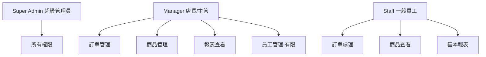
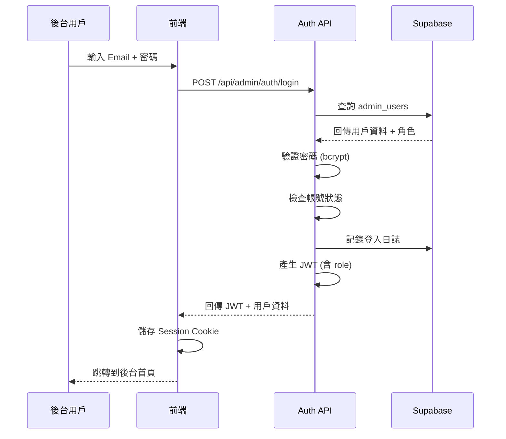
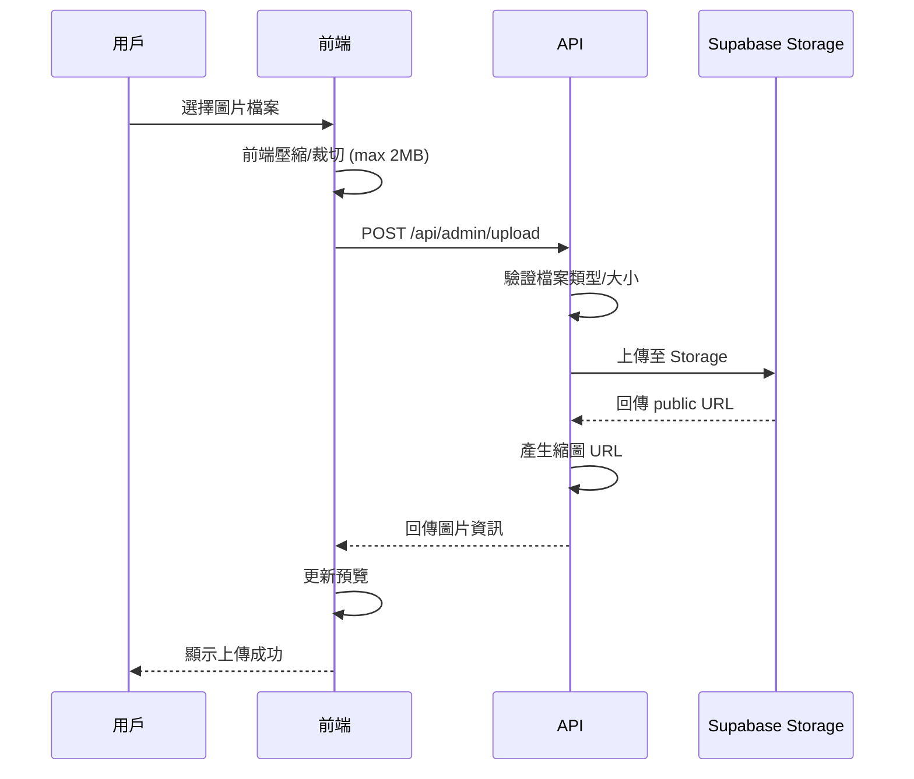
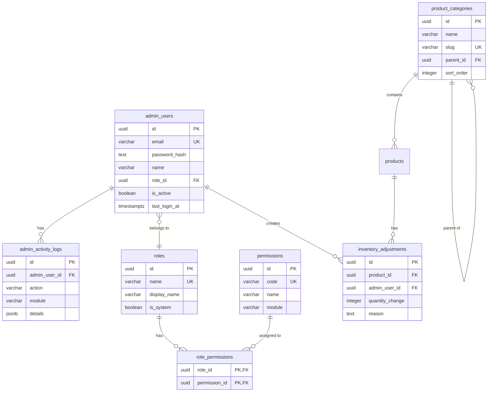

# 後台管理系統設計規劃

> **版本**: v1.0.0  
> **最後更新**: 2026-01-05  
> **狀態**: 規劃中

本文件詳細說明咖啡豆訂單系統後台管理功能的完整設計，包含帳號權限管理、商品管理、及 CRM 分析報表功能。

---

## 📑 目錄

1. [系統架構總覽](#一系統架構總覽)
2. [帳號權限管理系統](#二帳號權限管理系統)
3. [商品管理功能](#三商品管理功能)
4. [CRM 分析報表功能](#四crm-分析報表功能)
5. [資料庫設計](#五資料庫設計)
6. [API 設計](#六api-設計)
7. [實作優先順序](#七實作優先順序)

---

## 一、系統架構總覽

### 1.1 架構圖

```
┌─────────────────────────────────────────────────────────────────────────┐
│                          後台管理系統架構                                  │
├─────────────────────────────────────────────────────────────────────────┤
│                                                                          │
│  ┌──────────────┐    ┌──────────────┐    ┌──────────────┐               │
│  │  超級管理員   │    │   店長/主管   │    │   一般員工   │               │
│  │ (Super Admin)│    │   (Manager)   │    │   (Staff)   │               │
│  └──────┬───────┘    └──────┬───────┘    └──────┬───────┘               │
│         │                   │                   │                        │
│         └───────────────────┼───────────────────┘                        │
│                             ▼                                            │
│  ┌───────────────────────────────────────────────────────────────────┐  │
│  │                    權限驗證 Middleware                              │  │
│  │  - JWT Session 驗證                                                 │  │
│  │  - 角色權限檢查 (RBAC)                                              │  │
│  │  - 操作日誌記錄                                                      │  │
│  └───────────────────────────────────────────────────────────────────┘  │
│                             │                                            │
│         ┌───────────────────┼───────────────────┐                        │
│         ▼                   ▼                   ▼                        │
│  ┌──────────────┐    ┌──────────────┐    ┌──────────────┐               │
│  │   帳號管理   │    │   商品管理    │    │   報表分析   │               │
│  │   模組       │    │   模組       │    │   模組       │               │
│  └──────────────┘    └──────────────┘    └──────────────┘               │
│                             │                                            │
│                             ▼                                            │
│  ┌───────────────────────────────────────────────────────────────────┐  │
│  │                    Supabase (PostgreSQL)                          │  │
│  │  - admin_users (後台帳號)                                          │  │
│  │  - roles (角色)                                                    │  │
│  │  - permissions (權限)                                              │  │
│  │  - role_permissions (角色-權限關聯)                                 │  │
│  │  - admin_activity_logs (操作日誌)                                  │  │
│  │  - product_categories (商品分類)                                   │  │
│  └───────────────────────────────────────────────────────────────────┘  │
│                                                                          │
└─────────────────────────────────────────────────────────────────────────┘
```

### 1.2 技術選型

| 項目 | 技術 | 說明 |
|------|------|------|
| 認證方式 | JWT + RBAC | 基於角色的存取控制 |
| 圖片儲存 | Supabase Storage | 免費 1GB，支援 CDN |
| 報表圖表 | Recharts / Chart.js | React 友善的圖表庫 |
| 資料匯出 | xlsx / jspdf | Excel 和 PDF 匯出 |

---

## 二、帳號權限管理系統

### 2.1 角色定義 (RBAC - Role-Based Access Control)



### 2.2 角色權限矩陣

| 權限模組 | 權限代碼 | Super Admin | Manager | Staff |
|---------|----------|:-----------:|:-------:|:-----:|
| **帳號管理** | | | | |
| 查看所有帳號 | `admin:read` | ✅ | ✅ | ❌ |
| 建立帳號 | `admin:create` | ✅ | ❌ | ❌ |
| 編輯帳號 | `admin:update` | ✅ | 部分 | ❌ |
| 刪除/停用帳號 | `admin:delete` | ✅ | ❌ | ❌ |
| 指派角色 | `admin:assign_role` | ✅ | ❌ | ❌ |
| **訂單管理** | | | | |
| 查看訂單列表 | `orders:read` | ✅ | ✅ | ✅ |
| 查看訂單詳情 | `orders:read_detail` | ✅ | ✅ | ✅ |
| 更新訂單狀態 | `orders:update_status` | ✅ | ✅ | ✅ |
| 取消訂單 | `orders:cancel` | ✅ | ✅ | ❌ |
| 刪除訂單 | `orders:delete` | ✅ | ❌ | ❌ |
| 匯出訂單 | `orders:export` | ✅ | ✅ | ❌ |
| **商品管理** | | | | |
| 查看商品 | `products:read` | ✅ | ✅ | ✅ |
| 新增商品 | `products:create` | ✅ | ✅ | ❌ |
| 編輯商品 | `products:update` | ✅ | ✅ | ❌ |
| 上下架商品 | `products:toggle` | ✅ | ✅ | ❌ |
| 刪除商品 | `products:delete` | ✅ | ❌ | ❌ |
| 管理分類 | `categories:manage` | ✅ | ✅ | ❌ |
| **客戶管理** | | | | |
| 查看客戶列表 | `customers:read` | ✅ | ✅ | ✅ |
| 查看客戶詳情 | `customers:read_detail` | ✅ | ✅ | ❌ |
| 編輯客戶資料 | `customers:update` | ✅ | ✅ | ❌ |
| 刪除客戶 | `customers:delete` | ✅ | ❌ | ❌ |
| 匯出客戶 | `customers:export` | ✅ | ✅ | ❌ |
| **報表分析** | | | | |
| 銷售總覽報表 | `reports:sales_overview` | ✅ | ✅ | ✅ |
| 詳細銷售報表 | `reports:sales_detail` | ✅ | ✅ | ❌ |
| 客戶分析報表 | `reports:customer_analysis` | ✅ | ✅ | ❌ |
| 商品分析報表 | `reports:product_analysis` | ✅ | ✅ | ❌ |
| 營運報表 | `reports:operations` | ✅ | ✅ | ❌ |
| 財務報表 | `reports:financial` | ✅ | ❌ | ❌ |
| 匯出報表 | `reports:export` | ✅ | ✅ | ❌ |
| **系統設定** | | | | |
| 基本設定 | `settings:basic` | ✅ | ✅ | ❌ |
| 進階設定 | `settings:advanced` | ✅ | ❌ | ❌ |
| 查看操作日誌 | `logs:read` | ✅ | 部分 | ❌ |

### 2.3 帳號管理功能列表

| 功能 | 說明 | 權限需求 |
|------|------|---------|
| 帳號列表 | 顯示所有後台帳號，支援搜尋/篩選 | `admin:read` |
| 建立帳號 | 輸入 Email、姓名、指派角色 | `admin:create` |
| 編輯帳號 | 修改帳號資訊、角色 | `admin:update` |
| 停用/啟用帳號 | 暫停或恢復帳號存取 | `admin:delete` |
| 重設密碼 | 發送密碼重設郵件 | `admin:update` |
| 查看操作日誌 | 查看該帳號的操作記錄 | `logs:read` |

### 2.4 後台登入流程



---

## 三、商品管理功能

### 3.1 功能總覽

```
商品管理
├── 商品列表
│   ├── 搜尋（名稱、SKU）
│   ├── 篩選（分類、狀態、庫存）
│   ├── 排序（名稱、價格、建立時間）
│   └── 批次操作（上架/下架、刪除）
├── 新增商品
│   ├── 基本資訊
│   ├── 圖片上傳（多張）
│   ├── 定價設定
│   ├── 庫存管理
│   └── SEO 設定（可選）
├── 編輯商品
│   └── (同新增商品)
├── 商品分類管理
│   ├── 分類列表
│   ├── 新增/編輯分類
│   └── 分類排序
└── 庫存管理
    ├── 庫存總覽
    ├── 庫存調整記錄
    └── 低庫存預警設定
```

### 3.2 商品資料欄位

| 欄位 | 類型 | 必填 | 說明 |
|------|------|:----:|------|
| `name` | VARCHAR(255) | ✅ | 商品名稱 |
| `sku` | VARCHAR(50) | ✅ | 商品編號 (Stock Keeping Unit) |
| `description` | TEXT | ❌ | 商品描述（支援 Markdown） |
| `short_description` | VARCHAR(500) | ❌ | 簡短描述（用於列表顯示） |
| `category_id` | UUID | ❌ | 商品分類 |
| `price` | DECIMAL(10,2) | ✅ | 售價 |
| `cost_price` | DECIMAL(10,2) | ❌ | 成本價（用於利潤計算） |
| `compare_price` | DECIMAL(10,2) | ❌ | 原價（顯示折扣用） |
| `stock` | INTEGER | ✅ | 庫存數量 |
| `low_stock_threshold` | INTEGER | ❌ | 低庫存警戒值（預設 10） |
| `weight` | DECIMAL(8,2) | ❌ | 重量 (克) |
| `origin` | VARCHAR(100) | ❌ | 產地 |
| `roast_level` | ENUM | ❌ | 烘焙程度 (淺/中/深焙) |
| `flavor_notes` | TEXT[] | ❌ | 風味描述 (陣列) |
| `grind_options` | ENUM[] | ✅ | 可選研磨方式 |
| `images` | JSONB | ❌ | 圖片陣列 [{url, alt, order}] |
| `is_active` | BOOLEAN | ✅ | 是否上架 |
| `is_featured` | BOOLEAN | ✅ | 是否為精選商品 |
| `sort_order` | INTEGER | ❌ | 排序順序 |
| `meta_title` | VARCHAR(60) | ❌ | SEO 標題 |
| `meta_description` | VARCHAR(160) | ❌ | SEO 描述 |
| `created_by` | UUID | ✅ | 建立者 (admin_user_id) |
| `updated_by` | UUID | ❌ | 最後編輯者 |

### 3.3 圖片上傳功能

#### 上傳流程



#### 圖片規格

| 用途 | 尺寸 | 格式 | 說明 |
|------|------|------|------|
| 原圖 | 最大 2000x2000 | JPEG/PNG/WebP | 原始上傳圖片 |
| 商品列表 | 400x400 | WebP | 商品卡片縮圖 |
| 商品詳情 | 800x800 | WebP | 商品詳情頁大圖 |
| 縮圖 | 100x100 | WebP | 管理後台預覽 |

### 3.4 商品分類設計

```
咖啡豆分類
├── 單品咖啡
│   ├── 非洲產區
│   │   ├── 衣索比亞
│   │   └── 肯亞
│   ├── 中南美產區
│   │   ├── 巴西
│   │   ├── 哥倫比亞
│   │   └── 瓜地馬拉
│   └── 亞洲產區
│       ├── 印尼
│       └── 越南
├── 配方豆
│   ├── 義式配方
│   └── 手沖配方
├── 特選系列
│   ├── 莊園精選
│   └── 競標批次
└── 季節限定
```

### 3.5 庫存管理功能

| 功能 | 說明 |
|------|------|
| 庫存總覽 | 顯示所有商品庫存狀態 |
| 庫存調整 | 手動增減庫存（需填寫原因） |
| 調整記錄 | 記錄所有庫存變動歷史 |
| 低庫存預警 | 當庫存低於閾值時發送通知 |
| 批次匯入 | 透過 CSV/Excel 批次更新庫存 |

---

## 四、CRM 分析報表功能

### 4.1 報表總覽

```
分析報表
├── 📊 儀表板 (Dashboard)
│   ├── 今日銷售摘要
│   ├── 本週/本月營收趨勢
│   ├── 熱銷商品 Top 5
│   └── 即時訂單動態
├── 💰 銷售報表
│   ├── 銷售總覽
│   ├── 銷售趨勢分析
│   ├── 訂單分析
│   └── 付款方式分析
├── 👥 客戶報表
│   ├── 客戶總覽
│   ├── 客戶分群 (RFM)
│   ├── 客戶生命週期
│   └── 客戶取得分析
├── 📦 商品報表
│   ├── 商品銷售排行
│   ├── 分類銷售分析
│   ├── 庫存分析
│   └── 商品毛利分析
├── 🔄 營運報表
│   ├── 訂單處理效率
│   ├── 取貨方式分析
│   └── 時段分析
└── 📈 趨勢報表
    ├── 同期比較
    ├── 預測分析
    └── 季節性分析
```

### 4.2 儀表板 (Dashboard)

即時顯示關鍵營運指標：

```
┌──────────────────────────────────────────────────────────────────────┐
│                         📊 營運儀表板                                  │
├──────────────────────────────────────────────────────────────────────┤
│                                                                       │
│  ┌─────────────┐ ┌─────────────┐ ┌─────────────┐ ┌─────────────┐    │
│  │  今日營收    │ │  今日訂單    │ │  待處理訂單  │ │  低庫存商品  │    │
│  │  NT$ 15,800 │ │    12 筆    │ │    3 筆     │ │    2 項     │    │
│  │  ↑ 12.5%   │ │  ↑ 8.2%    │ │             │ │             │    │
│  └─────────────┘ └─────────────┘ └─────────────┘ └─────────────┘    │
│                                                                       │
│  ┌─────────────────────────────────┐ ┌─────────────────────────────┐ │
│  │      本週營收趨勢圖              │ │     熱銷商品 Top 5          │ │
│  │  ▲                              │ │                             │ │
│  │  │    ╱╲      ╱╲               │ │  1. 耶加雪菲     ████ 32   │ │
│  │  │   ╱  ╲    ╱  ╲              │ │  2. 曼特寧       ███ 28    │ │
│  │  │  ╱    ╲  ╱    ╲             │ │  3. 巴西山多士   ██ 21     │ │
│  │  │ ╱      ╲╱      ╲            │ │  4. 肯亞 AA     ██ 18      │ │
│  │  └─────────────────►           │ │  5. 哥倫比亞    █ 15       │ │
│  │    一 二 三 四 五 六 日          │ │                             │ │
│  └─────────────────────────────────┘ └─────────────────────────────┘ │
│                                                                       │
│  ┌─────────────────────────────────────────────────────────────────┐ │
│  │                    即時訂單動態                                   │ │
│  ├─────────────────────────────────────────────────────────────────┤ │
│  │  🟢 ORD-20260105-0012  張三  NT$1,200  已確認  10:30            │ │
│  │  🟡 ORD-20260105-0011  李四  NT$800   待處理   10:25            │ │
│  │  🟢 ORD-20260105-0010  王五  NT$1,500  準備中  10:15            │ │
│  └─────────────────────────────────────────────────────────────────┘ │
│                                                                       │
└──────────────────────────────────────────────────────────────────────┘
```

### 4.3 銷售報表

#### 4.3.1 銷售總覽報表

| 指標 | 說明 | 計算方式 |
|------|------|---------|
| 總營收 | 指定期間內的總銷售金額 | SUM(final_amount) |
| 訂單數 | 指定期間內的訂單總數 | COUNT(orders) |
| 平均客單價 | 每筆訂單平均金額 | 總營收 / 訂單數 |
| 退貨率 | 取消訂單佔比 | 取消訂單數 / 總訂單數 |
| 日均營收 | 每日平均營收 | 總營收 / 天數 |

#### 4.3.2 銷售趨勢分析

```
篩選條件：
├── 時間範圍：今日/本週/本月/本季/本年/自訂
├── 時間粒度：小時/日/週/月
├── 比較模式：同期比較（去年同期/上月同期）
└── 顯示類型：折線圖/柱狀圖/面積圖
```

#### 4.3.3 訂單狀態分析

| 狀態 | 顏色標示 | 分析指標 |
|------|---------|---------|
| 待處理 | 🟡 黃色 | 數量、平均等待時間 |
| 已確認 | 🔵 藍色 | 數量、確認速度 |
| 準備中 | 🟠 橘色 | 數量、製作時間 |
| 可取貨 | 🟢 綠色 | 數量、等待取貨時間 |
| 已完成 | ✅ 灰色 | 數量、完成率 |
| 已取消 | ❌ 紅色 | 數量、取消原因分析 |

#### 4.3.4 付款方式分析

```
付款方式佔比圓餅圖：
┌────────────────────────────────┐
│                                │
│        ╱───╲                  │
│      ╱  💵  ╲   現金 35%      │
│     │  現金  │                 │
│     │       │   轉帳 25%      │
│      ╲ 🏦  ╱                  │
│        ╲─╱                    │
│                                │
│  💳 信用卡 20%                 │
│  📱 LINE Pay 20%              │
│                                │
└────────────────────────────────┘
```

### 4.4 客戶報表

#### 4.4.1 客戶總覽

| 指標 | 說明 |
|------|------|
| 總客戶數 | 系統中的總客戶數量 |
| 活躍客戶 | 過去 30/60/90 天有消費的客戶 |
| 新客戶 | 指定期間新註冊的客戶 |
| 回購率 | 有第二次消費的客戶比例 |
| 平均消費頻率 | 客戶平均消費間隔 |

#### 4.4.2 RFM 客戶分群

RFM 模型是 CRM 系統中最重要的客戶分析工具：

| 指標 | 英文 | 說明 | 計算方式 |
|------|------|------|---------|
| R | Recency | 最近消費 | 最後訂單日期距今天數 |
| F | Frequency | 消費頻率 | 總訂單數 |
| M | Monetary | 消費金額 | 總消費金額 |

**客戶分群定義**：

| 分群名稱 | RFM 組合 | 行銷建議 |
|---------|---------|---------|
| 🌟 鑽石客戶 | R↑ F↑ M↑ | VIP 專屬優惠、優先服務 |
| 💎 忠實客戶 | R↑ F↑ M↓ | 提升客單價、推薦高價商品 |
| 🔥 潛力客戶 | R↑ F↓ M↑ | 增加互動、提高消費頻率 |
| 🆕 新客戶 | R↑ F↓ M↓ | 新客優惠、建立信任 |
| 😴 沉睡客戶 | R↓ F↑ M↑ | 喚醒活動、限時優惠 |
| ⚠️ 流失風險 | R↓ F↓ M↑ | 挽回方案、問卷調查 |
| 💤 已流失 | R↓ F↓ M↓ | 大型促銷、重新獲客 |

#### 4.4.3 客戶生命週期價值 (CLV)

```
CLV = 平均客單價 × 平均消費頻率(年) × 平均客戶壽命(年)
```

#### 4.4.4 客戶成長趨勢

```
┌────────────────────────────────────────────────────────────────┐
│                    客戶成長趨勢圖                                │
├────────────────────────────────────────────────────────────────┤
│  200 ┤                                           ╱──────      │
│      │                                     ╱────╱             │
│  150 ┤                               ╱────╱                   │
│      │                         ╱────╱                         │
│  100 ┤                   ╱────╱                               │
│      │             ╱────╱                                     │
│   50 ┤       ╱────╱                                           │
│      │ ╱────╱                                                 │
│    0 └────────────────────────────────────────────────────►   │
│        1月  2月  3月  4月  5月  6月  7月  8月  9月  10月       │
│                                                                │
│   ▬▬▬ 累計客戶數    ─ ─ ─ 新增客戶數                          │
└────────────────────────────────────────────────────────────────┘
```

### 4.5 商品報表

#### 4.5.1 商品銷售排行

| 排名 | 商品名稱 | 銷售數量 | 銷售金額 | 毛利率 |
|:----:|---------|--------:|--------:|------:|
| 1 | 耶加雪菲 | 128 | NT$ 64,000 | 45% |
| 2 | 曼特寧 | 96 | NT$ 43,200 | 42% |
| 3 | 巴西山多士 | 85 | NT$ 34,000 | 48% |
| ... | ... | ... | ... | ... |

#### 4.5.2 分類銷售分析

| 分類 | 銷售金額 | 佔比 | 較上期 |
|------|--------:|-----:|-------:|
| 單品咖啡 | NT$ 180,000 | 60% | ↑ 15% |
| 配方豆 | NT$ 90,000 | 30% | ↑ 8% |
| 特選系列 | NT$ 30,000 | 10% | ↓ 3% |

#### 4.5.3 庫存分析報表

| 報表類型 | 說明 |
|---------|------|
| 庫存週轉率 | 庫存周轉速度分析 |
| 庫存天數 | 平均庫存可銷售天數 |
| 滯銷商品 | 超過 N 天未銷售的商品 |
| 庫存價值 | 庫存總價值分析 |

#### 4.5.4 商品毛利分析

```
毛利率 = (售價 - 成本價) / 售價 × 100%
```

### 4.6 營運報表

#### 4.6.1 訂單處理效率

| 指標 | 說明 | 目標值 |
|------|------|--------|
| 平均確認時間 | 訂單建立到確認的平均時間 | < 10 分鐘 |
| 平均製作時間 | 確認到準備完成的平均時間 | < 30 分鐘 |
| 平均完成時間 | 訂單建立到完成的平均時間 | < 2 小時 |
| 準時完成率 | 在預期時間內完成的比例 | > 95% |

#### 4.6.2 取貨方式分析

| 取貨方式 | 訂單數 | 金額 | 平均客單價 |
|---------|------:|-----:|----------:|
| 自取 | 156 | NT$ 78,000 | NT$ 500 |
| 宅配 | 44 | NT$ 35,200 | NT$ 800 |

#### 4.6.3 時段分析

```
訂單時段分布：
┌────────────────────────────────────────────┐
│                                            │
│ 08-10 │████████████                12%    │
│ 10-12 │████████████████████████    24%    │
│ 12-14 │████████████████            16%    │
│ 14-16 │████████████████████        20%    │
│ 16-18 │████████████████            16%    │
│ 18-20 │████████                     8%    │
│ 20-22 │████                         4%    │
│                                            │
└────────────────────────────────────────────┘
```

### 4.7 報表功能列表

| 功能 | 說明 |
|------|------|
| 時間範圍選擇 | 預設範圍（今日/本週/本月）+ 自訂日期 |
| 即時更新 | 每 5 分鐘自動更新（可手動刷新） |
| 圖表切換 | 支援多種圖表類型切換 |
| 資料下載 | 匯出 Excel/CSV/PDF |
| 排程報表 | 設定定期發送報表到 Email |
| 收藏報表 | 將常用報表加入收藏 |
| 自訂儀表板 | 拖拉排列儀表板元件 |

---

## 五、資料庫設計

### 5.1 新增資料表

```sql
-- =====================================================
-- 007_create_admin_tables.sql
-- 後台管理系統相關資料表
-- =====================================================

-- 1. 角色表
CREATE TABLE roles (
  id UUID PRIMARY KEY DEFAULT gen_random_uuid(),
  name VARCHAR(50) NOT NULL UNIQUE,
  display_name VARCHAR(100) NOT NULL,
  description TEXT,
  is_system BOOLEAN NOT NULL DEFAULT false,  -- 系統角色不可刪除
  created_at TIMESTAMPTZ NOT NULL DEFAULT NOW(),
  updated_at TIMESTAMPTZ NOT NULL DEFAULT NOW()
);

-- 2. 權限表
CREATE TABLE permissions (
  id UUID PRIMARY KEY DEFAULT gen_random_uuid(),
  code VARCHAR(100) NOT NULL UNIQUE,
  name VARCHAR(100) NOT NULL,
  description TEXT,
  module VARCHAR(50) NOT NULL,  -- 模組分類
  created_at TIMESTAMPTZ NOT NULL DEFAULT NOW()
);

-- 3. 角色權限關聯表
CREATE TABLE role_permissions (
  role_id UUID NOT NULL REFERENCES roles(id) ON DELETE CASCADE,
  permission_id UUID NOT NULL REFERENCES permissions(id) ON DELETE CASCADE,
  PRIMARY KEY (role_id, permission_id)
);

-- 4. 後台用戶表
CREATE TABLE admin_users (
  id UUID PRIMARY KEY DEFAULT gen_random_uuid(),
  email VARCHAR(255) NOT NULL UNIQUE,
  password_hash TEXT NOT NULL,
  name VARCHAR(255) NOT NULL,
  avatar_url TEXT,
  role_id UUID NOT NULL REFERENCES roles(id),
  is_active BOOLEAN NOT NULL DEFAULT true,
  last_login_at TIMESTAMPTZ,
  login_count INTEGER NOT NULL DEFAULT 0,
  created_at TIMESTAMPTZ NOT NULL DEFAULT NOW(),
  updated_at TIMESTAMPTZ NOT NULL DEFAULT NOW()
);

-- 5. 操作日誌表
CREATE TABLE admin_activity_logs (
  id UUID PRIMARY KEY DEFAULT gen_random_uuid(),
  admin_user_id UUID NOT NULL REFERENCES admin_users(id),
  action VARCHAR(100) NOT NULL,
  module VARCHAR(50) NOT NULL,
  target_type VARCHAR(50),  -- 操作對象類型 (order, product, customer...)
  target_id UUID,           -- 操作對象 ID
  details JSONB,            -- 操作詳情
  ip_address INET,
  user_agent TEXT,
  created_at TIMESTAMPTZ NOT NULL DEFAULT NOW()
);

-- 6. 商品分類表
CREATE TABLE product_categories (
  id UUID PRIMARY KEY DEFAULT gen_random_uuid(),
  name VARCHAR(100) NOT NULL,
  slug VARCHAR(100) NOT NULL UNIQUE,
  description TEXT,
  parent_id UUID REFERENCES product_categories(id) ON DELETE SET NULL,
  image_url TEXT,
  sort_order INTEGER NOT NULL DEFAULT 0,
  is_active BOOLEAN NOT NULL DEFAULT true,
  product_count INTEGER NOT NULL DEFAULT 0,  -- 該分類商品數（由 Trigger 更新）
  created_at TIMESTAMPTZ NOT NULL DEFAULT NOW(),
  updated_at TIMESTAMPTZ NOT NULL DEFAULT NOW()
);

-- 7. 庫存調整記錄表
CREATE TABLE inventory_adjustments (
  id UUID PRIMARY KEY DEFAULT gen_random_uuid(),
  product_id UUID NOT NULL REFERENCES products(id),
  admin_user_id UUID NOT NULL REFERENCES admin_users(id),
  adjustment_type VARCHAR(20) NOT NULL,  -- increase, decrease, set
  quantity_before INTEGER NOT NULL,
  quantity_change INTEGER NOT NULL,
  quantity_after INTEGER NOT NULL,
  reason TEXT,
  created_at TIMESTAMPTZ NOT NULL DEFAULT NOW()
);

-- 索引
CREATE INDEX idx_admin_users_email ON admin_users(email);
CREATE INDEX idx_admin_users_role_id ON admin_users(role_id);
CREATE INDEX idx_admin_activity_logs_admin_user_id ON admin_activity_logs(admin_user_id);
CREATE INDEX idx_admin_activity_logs_created_at ON admin_activity_logs(created_at DESC);
CREATE INDEX idx_admin_activity_logs_module ON admin_activity_logs(module);
CREATE INDEX idx_product_categories_parent_id ON product_categories(parent_id);
CREATE INDEX idx_product_categories_slug ON product_categories(slug);
CREATE INDEX idx_inventory_adjustments_product_id ON inventory_adjustments(product_id);
```

### 5.2 擴展現有表

```sql
-- =====================================================
-- 008_extend_products_table.sql
-- 擴展商品表欄位
-- =====================================================

-- 新增商品欄位
ALTER TABLE products 
ADD COLUMN IF NOT EXISTS sku VARCHAR(50),
ADD COLUMN IF NOT EXISTS short_description VARCHAR(500),
ADD COLUMN IF NOT EXISTS category_id UUID REFERENCES product_categories(id) ON DELETE SET NULL,
ADD COLUMN IF NOT EXISTS cost_price DECIMAL(10, 2),
ADD COLUMN IF NOT EXISTS compare_price DECIMAL(10, 2),
ADD COLUMN IF NOT EXISTS low_stock_threshold INTEGER DEFAULT 10,
ADD COLUMN IF NOT EXISTS weight DECIMAL(8, 2),
ADD COLUMN IF NOT EXISTS origin VARCHAR(100),
ADD COLUMN IF NOT EXISTS roast_level VARCHAR(20),
ADD COLUMN IF NOT EXISTS flavor_notes TEXT[],
ADD COLUMN IF NOT EXISTS images JSONB DEFAULT '[]',
ADD COLUMN IF NOT EXISTS is_featured BOOLEAN NOT NULL DEFAULT false,
ADD COLUMN IF NOT EXISTS sort_order INTEGER DEFAULT 0,
ADD COLUMN IF NOT EXISTS meta_title VARCHAR(60),
ADD COLUMN IF NOT EXISTS meta_description VARCHAR(160),
ADD COLUMN IF NOT EXISTS created_by UUID REFERENCES admin_users(id),
ADD COLUMN IF NOT EXISTS updated_by UUID REFERENCES admin_users(id);

-- 新增索引
CREATE INDEX IF NOT EXISTS idx_products_category_id ON products(category_id);
CREATE INDEX IF NOT EXISTS idx_products_sku ON products(sku);
CREATE INDEX IF NOT EXISTS idx_products_is_featured ON products(is_featured);
CREATE UNIQUE INDEX IF NOT EXISTS idx_products_sku_unique ON products(sku) WHERE sku IS NOT NULL;
```

### 5.3 ER Diagram



---

## 六、API 設計

### 6.1 認證 API

| 方法 | 路徑 | 說明 | 權限 |
|------|------|------|------|
| POST | `/api/admin/auth/login` | 後台登入 | 公開 |
| POST | `/api/admin/auth/logout` | 登出 | 已登入 |
| GET | `/api/admin/auth/me` | 取得當前用戶資訊 | 已登入 |
| POST | `/api/admin/auth/refresh` | 刷新 Token | 已登入 |
| POST | `/api/admin/auth/forgot-password` | 忘記密碼 | 公開 |
| POST | `/api/admin/auth/reset-password` | 重設密碼 | 公開 |

### 6.2 帳號管理 API

| 方法 | 路徑 | 說明 | 權限 |
|------|------|------|------|
| GET | `/api/admin/users` | 取得帳號列表 | `admin:read` |
| POST | `/api/admin/users` | 建立帳號 | `admin:create` |
| GET | `/api/admin/users/:id` | 取得帳號詳情 | `admin:read` |
| PATCH | `/api/admin/users/:id` | 更新帳號 | `admin:update` |
| DELETE | `/api/admin/users/:id` | 刪除/停用帳號 | `admin:delete` |
| POST | `/api/admin/users/:id/reset-password` | 重設密碼 | `admin:update` |

### 6.3 角色權限 API

| 方法 | 路徑 | 說明 | 權限 |
|------|------|------|------|
| GET | `/api/admin/roles` | 取得角色列表 | `admin:read` |
| POST | `/api/admin/roles` | 建立角色 | Super Admin |
| PATCH | `/api/admin/roles/:id` | 更新角色權限 | Super Admin |
| DELETE | `/api/admin/roles/:id` | 刪除角色 | Super Admin |
| GET | `/api/admin/permissions` | 取得權限列表 | `admin:read` |

### 6.4 商品管理 API

| 方法 | 路徑 | 說明 | 權限 |
|------|------|------|------|
| GET | `/api/admin/products` | 取得商品列表 | `products:read` |
| POST | `/api/admin/products` | 新增商品 | `products:create` |
| GET | `/api/admin/products/:id` | 取得商品詳情 | `products:read` |
| PATCH | `/api/admin/products/:id` | 更新商品 | `products:update` |
| DELETE | `/api/admin/products/:id` | 刪除商品 | `products:delete` |
| PATCH | `/api/admin/products/:id/toggle` | 上下架商品 | `products:toggle` |
| POST | `/api/admin/products/bulk` | 批次操作 | `products:update` |
| POST | `/api/admin/upload` | 上傳圖片 | `products:create` |

### 6.5 分類管理 API

| 方法 | 路徑 | 說明 | 權限 |
|------|------|------|------|
| GET | `/api/admin/categories` | 取得分類列表 | `products:read` |
| POST | `/api/admin/categories` | 新增分類 | `categories:manage` |
| PATCH | `/api/admin/categories/:id` | 更新分類 | `categories:manage` |
| DELETE | `/api/admin/categories/:id` | 刪除分類 | `categories:manage` |
| POST | `/api/admin/categories/reorder` | 重新排序 | `categories:manage` |

### 6.6 報表 API

| 方法 | 路徑 | 說明 | 權限 |
|------|------|------|------|
| GET | `/api/admin/reports/dashboard` | 儀表板數據 | `reports:sales_overview` |
| GET | `/api/admin/reports/sales` | 銷售報表 | `reports:sales_detail` |
| GET | `/api/admin/reports/customers` | 客戶報表 | `reports:customer_analysis` |
| GET | `/api/admin/reports/products` | 商品報表 | `reports:product_analysis` |
| GET | `/api/admin/reports/operations` | 營運報表 | `reports:operations` |
| GET | `/api/admin/reports/rfm` | RFM 分析 | `reports:customer_analysis` |
| POST | `/api/admin/reports/export` | 匯出報表 | `reports:export` |

### 6.7 操作日誌 API

| 方法 | 路徑 | 說明 | 權限 |
|------|------|------|------|
| GET | `/api/admin/logs` | 取得操作日誌 | `logs:read` |
| GET | `/api/admin/logs/user/:userId` | 取得用戶操作日誌 | `logs:read` |

---

## 七、實作優先順序

### Phase 1：基礎設施（預估 3-5 天）

| 優先級 | 任務 | 說明 |
|:-----:|------|------|
| P0 | 建立資料庫遷移 | 執行 007, 008 遷移檔案 |
| P0 | 建立預設角色和權限 | Super Admin, Manager, Staff |
| P0 | 後台認證 API | 登入、登出、Session 管理 |
| P0 | 權限驗證 Middleware | RBAC 權限檢查 |

### Phase 2：帳號管理（預估 2-3 天）

| 優先級 | 任務 | 說明 |
|:-----:|------|------|
| P1 | 帳號 CRUD API | 建立、編輯、停用帳號 |
| P1 | 帳號管理介面 | 列表、表單、權限指派 |
| P1 | 操作日誌記錄 | 自動記錄關鍵操作 |

### Phase 3：商品管理（預估 3-4 天）

| 優先級 | 任務 | 說明 |
|:-----:|------|------|
| P1 | 商品 CRUD 完善 | 完整的商品編輯功能 |
| P1 | 圖片上傳 | Supabase Storage 整合 |
| P2 | 分類管理 | 商品分類 CRUD |
| P2 | 庫存管理 | 庫存調整、記錄、預警 |

### Phase 4：報表功能（預估 4-5 天）

| 優先級 | 任務 | 說明 |
|:-----:|------|------|
| P1 | 儀表板 | 即時營運數據 |
| P1 | 銷售報表 | 銷售總覽、趨勢分析 |
| P2 | 客戶報表 | 客戶分析、RFM 分群 |
| P2 | 商品報表 | 銷售排行、庫存分析 |
| P3 | 報表匯出 | Excel/PDF 匯出功能 |

### Phase 5：進階功能（預估 2-3 天）

| 優先級 | 任務 | 說明 |
|:-----:|------|------|
| P3 | 自訂儀表板 | 拖拉排列元件 |
| P3 | 排程報表 | 定期發送 Email |
| P3 | 批次操作 | 批次上下架、匯入 |

---

## 附錄

### A. 預設權限清單

```sql
-- 初始化權限資料
INSERT INTO permissions (code, name, module) VALUES
-- 帳號管理
('admin:read', '查看帳號', 'admin'),
('admin:create', '建立帳號', 'admin'),
('admin:update', '編輯帳號', 'admin'),
('admin:delete', '停用帳號', 'admin'),
('admin:assign_role', '指派角色', 'admin'),
-- 訂單管理
('orders:read', '查看訂單列表', 'orders'),
('orders:read_detail', '查看訂單詳情', 'orders'),
('orders:update_status', '更新訂單狀態', 'orders'),
('orders:cancel', '取消訂單', 'orders'),
('orders:delete', '刪除訂單', 'orders'),
('orders:export', '匯出訂單', 'orders'),
-- 商品管理
('products:read', '查看商品', 'products'),
('products:create', '新增商品', 'products'),
('products:update', '編輯商品', 'products'),
('products:toggle', '上下架商品', 'products'),
('products:delete', '刪除商品', 'products'),
('categories:manage', '管理分類', 'products'),
-- 客戶管理
('customers:read', '查看客戶列表', 'customers'),
('customers:read_detail', '查看客戶詳情', 'customers'),
('customers:update', '編輯客戶', 'customers'),
('customers:delete', '刪除客戶', 'customers'),
('customers:export', '匯出客戶', 'customers'),
-- 報表
('reports:sales_overview', '銷售總覽', 'reports'),
('reports:sales_detail', '詳細銷售報表', 'reports'),
('reports:customer_analysis', '客戶分析', 'reports'),
('reports:product_analysis', '商品分析', 'reports'),
('reports:operations', '營運報表', 'reports'),
('reports:financial', '財務報表', 'reports'),
('reports:export', '匯出報表', 'reports'),
-- 系統
('settings:basic', '基本設定', 'settings'),
('settings:advanced', '進階設定', 'settings'),
('logs:read', '查看操作日誌', 'system');
```

### B. 報表 SQL 範例

```sql
-- 銷售總覽
SELECT 
  DATE(created_at) as date,
  COUNT(*) as order_count,
  SUM(final_amount) as total_revenue,
  AVG(final_amount) as avg_order_value
FROM orders
WHERE status != 'cancelled'
  AND created_at BETWEEN :start_date AND :end_date
GROUP BY DATE(created_at)
ORDER BY date DESC;

-- RFM 分析
WITH customer_rfm AS (
  SELECT 
    c.id,
    c.name,
    c.email,
    EXTRACT(DAY FROM NOW() - MAX(o.created_at)) as recency,
    COUNT(o.id) as frequency,
    COALESCE(SUM(o.final_amount), 0) as monetary
  FROM customers c
  LEFT JOIN orders o ON c.id = o.customer_id AND o.status != 'cancelled'
  GROUP BY c.id, c.name, c.email
)
SELECT 
  *,
  NTILE(5) OVER (ORDER BY recency DESC) as r_score,
  NTILE(5) OVER (ORDER BY frequency) as f_score,
  NTILE(5) OVER (ORDER BY monetary) as m_score
FROM customer_rfm;
```

---

## 版本歷史

| 版本 | 日期 | 說明 |
|------|------|------|
| v1.0.0 | 2026-01-05 | 初始規劃文件 |

---

## 相關文件

- [README.md](../README.md) - 專案說明
- [DATABASE.md](../DATABASE.md) - 資料庫結構
- [SETUP.md](../SETUP.md) - 系統設定指南

