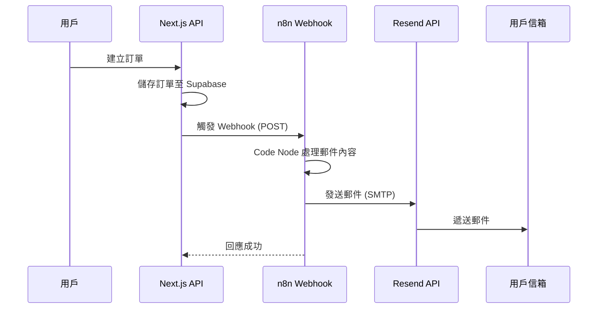

# n8n 新訂單郵件通知設定指南

## 📋 概述

當系統產生新訂單時，會自動觸發 webhook 將訂單資料發送至 n8n，n8n 再透過 `noreply@qwerboy.com` 發送訂單確認郵件給使用者。

## 🔧 系統架構



## 📂 檔案說明

| 檔案 | 說明 |
|------|------|
| `new-order-email-workflow.json` | n8n 完整工作流程（可直接匯入） |
| `new-order-email-code.js` | Code 節點的 JavaScript 代碼 |

---

## 🚀 Step 1: 設定 n8n 工作流程

### 方法 A: 匯入完整工作流程

1. 登入 n8n（例如 `https://qwerboy.app.n8n.cloud`）
2. 點擊 **Workflows** → **Import from File**
3. 選擇 `new-order-email-workflow.json`
4. 匯入後修改 SMTP 憑證（見 Step 2）

### 方法 B: 手動建立工作流程

#### 節點 1: Webhook Trigger

- **Type**: Webhook
- **HTTP Method**: POST
- **Path**: `new-order`（或自訂）
- 記下產生的 Webhook URL

#### 節點 2: Code Node

- **Type**: Code
- **Language**: JavaScript
- 將 `new-order-email-code.js` 的內容貼入

#### 節點 3: Send Email

- **Type**: Send Email 或 HTTP Request（使用 Resend API）
- **From**: `noreply@qwerboy.com`
- **To**: `{{ $json.to }}`
- **Subject**: `{{ $json.subject }}`
- **HTML**: `{{ $json.html }}`

#### 節點 4: Set Response（可選）

- 設定回應狀態

---

## 🔐 Step 2: 設定 Resend SMTP 憑證

### 在 n8n 中建立 SMTP 憑證

1. 進入 **Settings** → **Credentials**
2. 點擊 **Add Credential**
3. 選擇 **SMTP**
4. 填入以下資訊：

| 欄位 | 值 |
|------|-----|
| Host | `smtp.resend.com` |
| Port | `465` (SSL) 或 `587` (TLS) |
| User | `resend` |
| Password | `re_xxxxxxxxxx`（您的 Resend API Key） |
| SSL/TLS | ✅ 啟用 |

5. 測試連線後儲存

### 或者使用 HTTP Request + Resend API

如果偏好直接呼叫 API，可使用 HTTP Request 節點：

```javascript
// 在 Code Node 最後返回：
return {
  method: 'POST',
  url: 'https://api.resend.com/emails',
  headers: {
    'Authorization': 'Bearer YOUR_RESEND_API_KEY',
    'Content-Type': 'application/json'
  },
  body: JSON.stringify({
    from: 'noreply@qwerboy.com',
    to: order.customer_email,
    subject: `[訂單確認] ${order.order_id} - 咖啡豆訂單系統`,
    html: generateEmailHtml(order)
  })
};
```

---

## 🌐 Step 3: 設定環境變數

在專案的 `.env.local` 和 Vercel 環境變數中設定：

```bash
# n8n Webhook URL（從 n8n Webhook 節點取得）
N8N_WEBHOOK_URL=https://qwerboy.app.n8n.cloud/webhook/xxxxxxxx-xxxx-xxxx-xxxx-xxxxxxxxxxxx

# 選填：Webhook 密鑰（用於驗證請求來源）
N8N_WEBHOOK_SECRET=your-secret-key
```

### Vercel 環境變數設定

1. 前往 Vercel Dashboard → 專案 → Settings → Environment Variables
2. 新增 `N8N_WEBHOOK_URL`
3. 選擇 Production、Preview、Development 環境
4. 重新部署

---

## 📬 Step 4: 測試工作流程

### 使用測試腳本

```bash
cd scripts/n8n
node test-webhook.js
```

### 手動測試 Webhook

```bash
curl -X POST "YOUR_N8N_WEBHOOK_URL" \
  -H "Content-Type: application/json" \
  -d '{
    "order_id": "TEST-20260105-001",
    "customer_name": "測試用戶",
    "customer_phone": "0912345678",
    "customer_email": "your-email@example.com",
    "pickup_method": "自取",
    "payment_method": "現金",
    "total_amount": 1500,
    "final_amount": 1500,
    "order_items": [
      {
        "product_name": "衣索比亞 耶加雪菲",
        "quantity": 2,
        "unit_price": 450,
        "grind_option": "細研磨（手沖）"
      },
      {
        "product_name": "哥倫比亞 薇拉",
        "quantity": 1,
        "unit_price": 380,
        "grind_option": "原豆（不磨）"
      }
    ],
    "notes": "請幫我多磨細一點"
  }'
```

---

## 📧 郵件範本預覽

郵件內容包含：

1. **標題區塊** - 咖啡主題配色（琥珀色漸層）
2. **訂單編號** - 醒目顯示
3. **訂單狀態** - 綠色標籤「訂單已成立」
4. **訂購人資訊** - 姓名、電話、Email、取件/付款方式
5. **訂單明細表格** - 商品、研磨方式、數量、單價
6. **金額明細** - 小計、折扣、應付金額
7. **備註** - 如有填寫
8. **後續步驟** - 根據取件方式顯示不同指引
9. **頁尾** - 免責聲明和版權

---

## 🔍 故障排除

### 問題：Webhook 未觸發

1. 檢查 `N8N_WEBHOOK_URL` 是否正確設定
2. 確認 n8n 工作流程已啟用（Active）
3. 查看 Next.js 日誌：`console.log('Order created webhook triggered successfully')`

### 問題：郵件未送達

1. 確認 Resend API Key 有效
2. 檢查 `noreply@qwerboy.com` 網域是否已在 Resend 驗證
3. 查看 n8n 執行日誌

### 問題：Webhook 回傳錯誤

1. 在 n8n 查看執行歷史
2. 檢查 Code Node 是否有語法錯誤
3. 確認輸入資料格式正確

---

## 📝 Webhook Payload 格式

系統發送的 Webhook 資料格式：

```typescript
interface OrderWebhookPayload {
  order_id: string;           // 訂單編號，如 "ORD-20260105-ABC123"
  customer_name: string;       // 客戶姓名
  customer_phone: string;      // 客戶電話
  customer_email: string;      // 客戶 Email
  pickup_method: string;       // "自取" | "宅配"
  payment_method: string;      // "現金" | "銀行轉帳" | "信用卡" | "LINE Pay"
  total_amount: number;        // 商品小計
  final_amount: number;        // 應付金額
  discount_amount?: number;    // 折扣金額（可選）
  order_items: Array<{
    product_name: string;      // 商品名稱
    quantity: number;          // 數量
    unit_price: number;        // 單價
    grind_option: string;      // 研磨方式
  }>;
  notes?: string;              // 備註（可選）
}
```

---

## ✅ 完成清單

- [ ] 在 n8n 建立/匯入工作流程
- [ ] 設定 SMTP 憑證（Resend）
- [ ] 取得 Webhook URL
- [ ] 設定環境變數 `N8N_WEBHOOK_URL`
- [ ] 在 Vercel 設定環境變數
- [ ] 啟用工作流程
- [ ] 測試訂單建立 → 收到確認郵件

---

*最後更新：2026-01-05*

